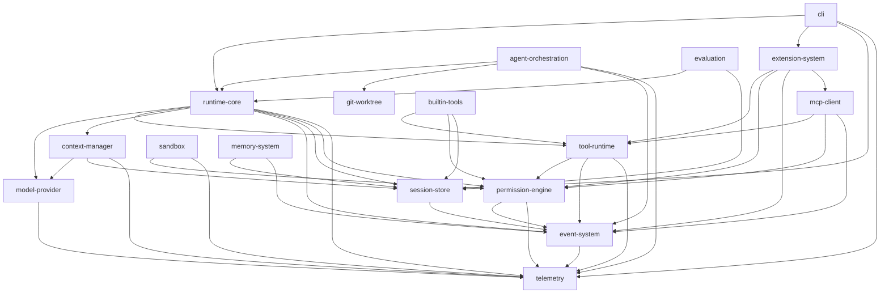

# DEPENDENCY_GRAPH

依赖方向遵循分层：

```text
CLI
  ↓
Application / Runtime Coordinator (runtime-core, agent-orchestration)
  ↓
Core Domain Interfaces (tool-runtime, permission-engine, context-manager, event-system, model-provider 接口)
  ↓
Infrastructure Implementations (builtin-tools, mcp-client, sandbox, session-store, memory-system, git-worktree, model-provider 适配器, telemetry)
```

核心规则：领域层（接口）不得依赖 CLI/TUI/具体 DB 实现；`runtime-core` 不得依赖任何具体 Provider；具体实现通过接口被注入。

## 模块依赖图（Mermaid）



## 循环依赖检查

经检查 **无循环依赖**。需注意的潜在风险点与处理：

- `runtime-core ↔ tool-runtime`：单向。`runtime-core` 调用 `tool-runtime.Invoker`；`tool-runtime` 通过 `event-system` 回报，不反向 import `runtime-core`。
- `builtin-tools` 依赖 `session-store`（写前 Checkpoint）：单向，且通过 `Checkpointer` 接口注入，不产生环。
- `extension-system → mcp-client`：Skill 可声明 MCP 依赖。单向。
- `agent-orchestration → runtime-core`：SubAgent/Team 复用 Runtime 启动子 Agent。单向；`runtime-core` 不 import `agent-orchestration`（父子关系由 orchestration 编排）。
- `telemetry` 与 `event-system`：`event-system → telemetry`（记录 Bus 内部日志），`telemetry` 不 import `event-system`（AuditSink 以 `Subscriber` 接口被注册，依赖反转）。避免环。

## 接口注入约定

- 接口定义放在**被依赖方**或独立契约位置；实现通过构造注入（构造函数 / wire）。
- `runtime-core` 只见 `model-provider.Provider`、`tool-runtime.Invoker`、`session-store.Store` 等接口，不见具体类型。
- 这是 ADR-0003（Provider 解耦）与 ADR-0005（Permission 独立于 Executor）的落地约束。
