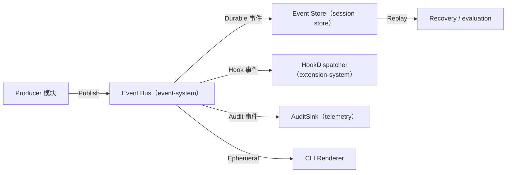

# EVENT_MODEL

ForgeCode 全系统使用 **单一 Event Envelope**。任何模块不得自定义事件格式（反模式：多个模块各自维护事件格式）。事件格式契约由 `event-system` 拥有，持久化由 `session-store` 负责。

## Event Envelope

```go
type Event struct {
    EventID       string          // 全局唯一（ULID/UUID）
    EventType     EventType       // 见下方枚举
    Timestamp     time.Time       // 产生时间（注入式 Clock，便于测试）
    SchemaVersion int             // Envelope/Payload schema 版本
    SessionID     string          // 所属 Session
    AgentID       string          // 产生事件的 Agent（父或子）
    TaskID        string          // Team Task（可空）
    TeamID        string          // Team（可空）
    CorrelationID string          // 关联同一逻辑操作的事件
    CausationID   string          // 触发本事件的上游 EventID
    Sequence      int64           // 单 Session 内单调递增序号
    Payload       json.RawMessage // 类型相关负载
}
```

`Sequence` 由 `session-store` 在 append 时分配，保证单 Session 内严格有序与幂等去重（同 EventID 重复写入被忽略）。

## EventType 枚举（权威）

生命周期事件（与 Hook 一一对应，见 master-plan §2.7）：

```text
SessionStart        SessionEnd          UserPromptSubmit
PreModelCall        PostModelCall       ModelCallFailed
PreToolUse          PostToolUse         ToolFailure
ApprovalRequested   ApprovalResolved
PreCompact          PostCompact
MemoryRead          MemoryWrite
SubAgentStart       SubAgentStop
WorktreeCreate      WorktreeRemove
TeamCreated         TeamClosed
TaskCreated         TaskAssigned        TaskCompleted       TaskFailed
```

运行时内部事件（不一定触发 Hook）：

```text
AgentStateChanged   ToolRequested       ToolObserved
CheckpointCreated   CheckpointRestored
BudgetExceeded      LoopDetected
ProviderRetry       SessionPaused       SessionResumed
AuditRecorded
```

## 事件分类

| 用途 | 说明 | 示例 |
| --- | --- | --- |
| 持久化(Durable) | 写入 Event Store，参与恢复 | SessionStart, UserPromptSubmit, PostModelCall, ToolRequested, PostToolUse, ApprovalResolved, CheckpointCreated, AgentStateChanged |
| 恢复(Recovery) | 重建状态所必需的子集 | AgentStateChanged, ToolRequested/Observed, ApprovalResolved, CheckpointCreated/Restored, SessionPaused/Resumed |
| 审计(Audit) | 由 telemetry AuditSink 消费、不可篡改 | ApprovalRequested/Resolved, PreToolUse(高风险), AuditRecorded, WorktreeCreate/Remove |
| Hook | 触发 extension-system HookDispatcher | §2.7 全部生命周期事件 |
| 可丢弃(Ephemeral) | 仅用于实时 UI/调试，可不持久化 | StreamChunk 级进度、ToolObserved 中间进度 |

> 一个事件可同时属于多个用途（如 `ApprovalResolved` 同时是持久化、恢复、审计、Hook）。

## 顺序与幂等

- **顺序**：同一 Session 内按 `Sequence` 严格有序；Bus 对单个订阅者保证有序投递。
- **幂等**：Event Store 以 `EventID` 去重；恢复重放必须幂等（重放不产生外部副作用）。
- **错误隔离**：单个订阅者处理失败不影响其他订阅者；Hook 失败按其失败策略处理（见 extension-system Spec）。

## 关系：Event Bus vs Event Store



恢复时由 `session-store` 读取持久化事件，`runtime-core` 重放重建状态，**不重新触发外部副作用**（工具不重新执行，使用已记录的 ToolResult）。
