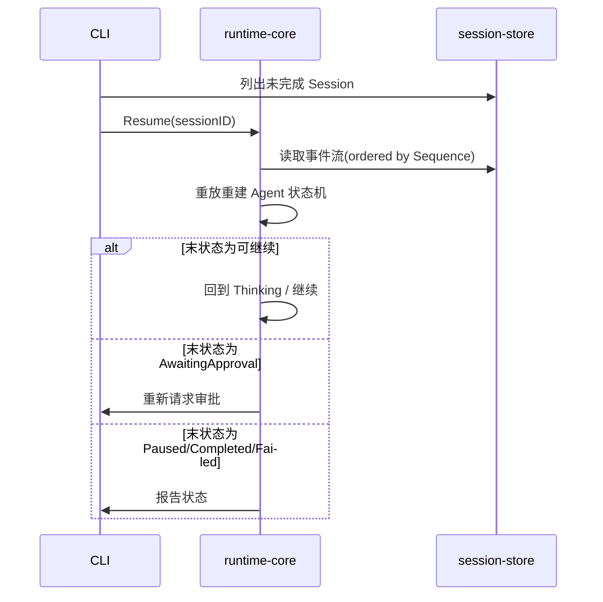

# FAILURE_AND_RECOVERY

ForgeCode 的可恢复性建立在 **Append-only 事件 + Checkpoint + 显式状态机** 之上。本文件分析各类失败的检测、影响与恢复策略。

## 总原则

- **写前事件 / 写前 Checkpoint**：高风险或不可逆操作前先落事件或 Checkpoint。
- **恢复 = 重放持久化事件重建状态**，不重新触发外部副作用（工具不重放执行，使用已记录 ToolResult）。
- **幂等**：恢复流程可重复执行而不产生额外副作用。
- 每类失败都对应一个错误分类（见 `GLOSSARY.md`）与至少一个 Failure Injection 测试。

## 失败场景矩阵

| 场景 | 检测 | 影响 | 恢复策略 | 责任模块 |
| --- | --- | --- | --- | --- |
| 模型请求中断 | HTTP/超时错误 | 当前轮失败 | 区分可重试，指数退避重试；超限→Failed 事件 | model-provider, runtime-core |
| Streaming 中断 | 流提前结束/EOF | 部分响应 | 丢弃半成品，按已落事件重试该轮 | model-provider |
| Tool 执行中断 | 超时/进程错误/取消 | 工具无结果或半结果 | WriteFile 失败保持原文件；落 ToolFailure；返回 Observation 让模型决定 | tool-runtime, builtin-tools |
| 进程崩溃 | 重启时检测未结束 Session | 内存态丢失 | 读事件流重建至最后一致状态，回到安全状态（如 AwaitingApproval/Paused） | session-store, runtime-core |
| SQLite 写入失败 | 写错误/锁 | 事件未落盘 | 重试写入；持续失败→暂停 Session 并告警，不静默丢事件 | session-store |
| Worktree 创建失败 | git 错误 | 子任务无法隔离执行 | 落 ToolFailure/事件；回收半创建资源；任务标记 Failed 可重试 | git-worktree |
| MCP 连接断开 | 健康检查/调用错误 | 该 Server 工具不可用 | 标记不健康、尝试重连；调用返回明确错误，不阻塞其他工具 | mcp-client |
| Hook 超时 | Timeout | 决策延迟 | 按 Hook 失败策略（默认 fail-closed 对安全敏感事件 / fail-open 对通知类） | extension-system |
| SubAgent 失联 | 超时/取消 | 委派结果缺失 | 取消子 Agent、回收资源、父按重试策略或降级 | agent-orchestration |
| Team Member 失败 | Task 状态/超时 | DAG 阻塞 | Task→Failed；依赖任务保持 Blocked；Lead 重试或人工介入 | agent-orchestration |
| 用户取消 | Context Cancellation | 当前操作终止 | 传播取消到工具/子 Agent；落 Cancelled；可恢复或结束 | runtime-core |
| Context Compaction 失败 | 压缩后校验不过 | 上下文可能损坏 | 回滚到 PreCompact Checkpoint，跳过本次压缩并告警 | context-manager |
| 审批后执行前崩溃 | 重启检测 ApprovalResolved 无 PostToolUse | 操作状态不明 | 不自动执行；恢复到 AwaitingApproval 或重新评估（默认重判，安全侧） | permission-engine, runtime-core, session-store |

## 重启后恢复流程

## 不变量（恢复后必须成立）

- 用户原始目标、当前计划、已完成步骤、关键文件与行号、未解决问题、下一步在压缩后仍保留（FR-CONTEXT-005）。
- 已记录的 ToolResult 在恢复后不被重新执行。
- 审批未完成的高危操作恢复后不会被自动执行。
- 事件序号连续、无重复（EventID 去重保证）。
