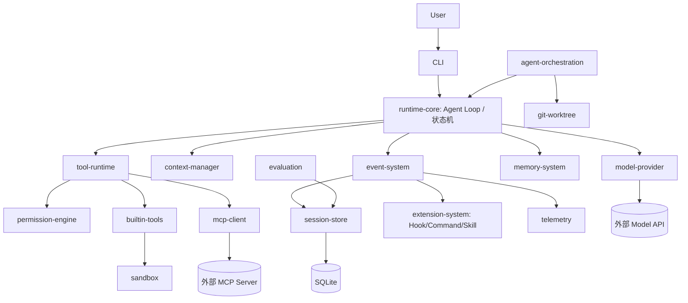

# SYSTEM_OVERVIEW

## 项目目标
ForgeCode 是用 Go 自主实现的、模型无关的 Coding Agent Runtime 控制平面。目标是让代码任务的执行 **安全、可恢复、可扩展、可观测、可并行**，而非封装某个 Agent SDK。详细目标见 `docs/specs/00-master/SPEC.md` §6.2。

## 系统边界
- **In**：Agent Loop 与状态机、Provider 抽象、统一工具/权限/审计管线、上下文与预算、事件与持久化、扩展系统、MCP 接入、记忆、SubAgent/Worktree/Team 编排、CLI。
- **Out（第一版）**：完整 IDE、复杂 TUI、自研容器运行时、向量数据库、去中心化多 Agent 协商。

## 核心组件

## 关键流程
见 Master SPEC §6.7（普通只读、代码修改、危险 Bash 审批、自动压缩、暂停恢复、MCP 调用、Skill 加载、SubAgent 委派、Worktree 修改、Team 执行、失败恢复、用户取消）。

## 运行模式
- **单 Agent 交互模式（MVP）**：CLI ↔ 单个 Runtime，REPL 式提交任务。
- **SubAgent 委派模式（V0.3）**：父 Agent 启动隔离子 Agent 完成子任务。
- **Team 模式（V1.0）**：中心化 Lead 调度 Task DAG。

## 部署模式
- 本地 CLI 二进制 + 本地 SQLite + 本地文件系统。
- Sandbox 需本地 Docker（可选；缺失时降级）。
- MCP Server 经 stdio 子进程或 Streamable HTTP 接入。

## 技术选型（初步）
- 语言：Go（版本待定，见 OPEN_QUESTIONS Q1）。
- 存储：SQLite（含 FTS5）。
- CLI：待定（cobra 候选）。
- 可观测：结构化日志 + 可选 OpenTelemetry。
- Git：`git` CLI 或 `go-git`（见 OPEN_QUESTIONS）。
- Sandbox：Docker SDK / CLI。
> 选型决策记录在对应 ADR；未定项记录在 `planning/OPEN_QUESTIONS.md`，**不虚构命令**。

## MVP 边界
MVP（M1–M5）交付单 Agent 可演示闭环：只读任务、代码修改、危险 Bash 审批、上下文自动压缩、Session 暂停/恢复、用户取消。不依赖 Agent Teams 完整实现。模块集见 `MODULE_MAP.md`。
