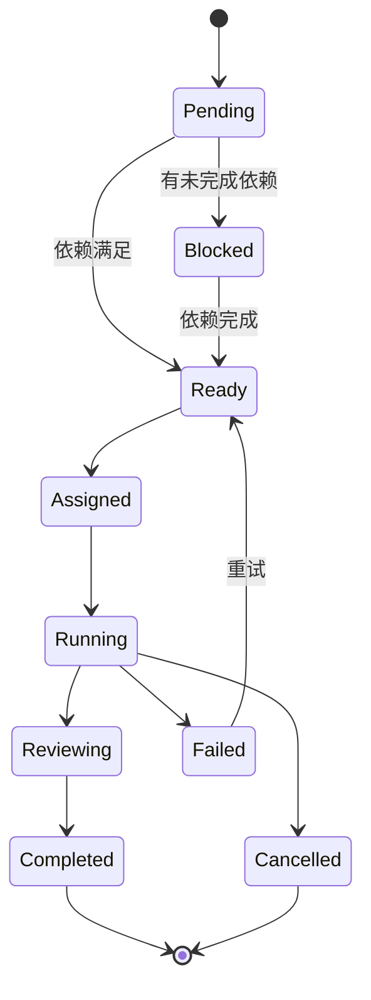
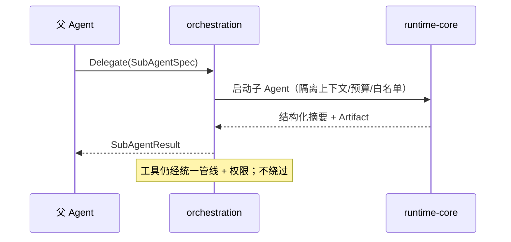

# agent-orchestration Spec

## 1. Module Info

| 字段 | 值 |
| --- | --- |
| Module ID | `agent-orchestration` |
| Module Name | Agent Orchestration（Task + SubAgent + Agent Team + Mailbox + Artifact Store） |
| Status | Draft |
| Owner | 架构组（占位） |
| Dependencies | runtime-core, git-worktree, event-system, telemetry |
| Dependents | cli, runtime-core |
| Related Requirements | FR-SUBAGENT-001..004, FR-TEAM-001..003 |
| Related ADRs | ADR-0008, ADR-0009 |
| MVP | No（SubAgent V0.3 / Team V1.0） |

## 2. Purpose
agent-orchestration 负责多 Agent 协作：一次性任务委派（SubAgent）与长期角色协作（Agent Team）。它复用 runtime-core 启动子 Agent，提供独立预算、并发控制、取消、结果集成与中心化 Task DAG 调度。

## 3. Scope
- SubAgent：独立身份/上下文/预算/工具白名单/权限策略；结构化委派与结果摘要；并发/超时/取消/重试；递归深度限制。
- Agent Team：Team Lead、Task DAG、Member Registry、Mailbox、Artifact Store、Shared State、Team Budget；中心化调度、定向/广播消息、结果集成、冲突处理。
- 明确区分 SubAgent（一次性）与 Team（长期角色 + 共享 DAG）。

## 4. Non-goals
- 不实现 Agent Loop（复用 runtime-core）。
- 不实现 Worktree 操作（git-worktree）。
- 不做去中心化协商/自由辩论（ADR-0009）。
- 第一版不支持任意深度嵌套（递归深度 ≤ 3，OPEN_QUESTIONS Q14）。

## 5. Responsibilities
- 拥有 AgentDefinition、Task、Team、Artifact。
- 构造子 Agent 的隔离运行环境（独立上下文/预算/白名单），经 runtime-core 启动。
- SubAgent 默认返回结构化摘要而非完整日志；工具输出隔离；不默认继承全部父上下文。
- Team Lead 维护 Task DAG，按依赖调度 Ready 任务，集成结果。
- 父子/团队预算统计与递归深度限制。

## 6. Public Interfaces

```go
type Delegator interface {
    Delegate(ctx context.Context, spec SubAgentSpec) (SubAgentResult, error)
    DelegateMany(ctx context.Context, specs []SubAgentSpec, limit int) ([]SubAgentResult, error)
}

type SubAgentSpec struct {
    AgentDefID    string
    SystemPrompt  string
    Task          StructuredTask  // 输入 + Expected Output
    TokenBudget   int
    CostBudgetUSD float64
    ToolAllow, ToolDeny []string
    Skills        []string
    Permission    PolicyRef
    Depth         int             // 递归深度
}

type SubAgentResult struct {
    AgentID  string
    Summary  string              // 默认结构化摘要，非完整日志
    Artifacts []ArtifactRef
    Usage    UsageRef
    Status   string              // Completed|Failed|Cancelled|Timeout
}

type TeamLead interface {
    CreateTeam(ctx, TeamSpec) (*Team, error)
    SubmitGraph(ctx, teamID string, dag TaskGraph) error
    Run(ctx, teamID string) (TeamResult, error)
}

type Mailbox interface {
    Send(ctx, msg Message) error      // 定向
    Broadcast(ctx, teamID string, msg Message) error
    Receive(ctx, agentID string) (<-chan Message, error)
}

type ArtifactStore interface {
    Put(ctx, a Artifact) (ArtifactRef, error)
    Get(ctx, ref ArtifactRef) (Artifact, error)
}
```

## 7. Domain Model
- `AgentDefinition`（角色/系统提示/默认白名单/权限）。
- `SubAgentSpec`/`SubAgentResult`。
- `Task`（DAG 节点，Task State 见 GLOSSARY）、`TaskGraph`、`Team`（Team State）、`Message`、`Artifact`。
- 本模块拥有 AgentDefinition/Task/Team/Artifact。AgentInstance 运行态属 runtime-core（只读其状态调度）。

## 8. State Machine
Task 状态（Team 调度用）：



Team 状态：`Forming → Active → Reviewing → Closed/Failed`。

## 9. Core Flows
- **SubAgent 委派**：父构造 SubAgentSpec（隔离上下文/预算/白名单）→ runtime-core 启动子 → 子独立执行（工具仍经统一管线+权限）→ 返回结构化摘要 + Artifact → SubAgentStart/Stop 事件。
- **并发委派**：DelegateMany 受 limit 并发上限；任一超时/失败按策略重试或降级。
- **Team 执行**：CreateTeam → SubmitGraph（Task DAG）→ Lead 调度 Ready 任务给成员 → Mailbox 通信 + Artifact 共享 → Reviewing → 结果集成 → Closed。
- **冲突**：多成员改同文件经 git-worktree 隔离（ADR-0008），合并冲突提交 Lead 处理。
- **取消**：取消传播到子 Agent/成员，回收资源。



## 10. Configuration

| Key | 默认值 | 作用域 | 敏感 | 说明 |
| --- | --- | --- | --- | --- |
| `orch.max_subagent_concurrency` | 4 | 全局 | 否 | 并发子 Agent 上限 |
| `orch.max_recursion_depth` | 3 | 全局 | 否 | 递归深度限制 |
| `orch.subagent_timeout` | 10m | Spec | 否 | 子 Agent 超时 |
| `orch.team_token_budget` | 父预算切分 | Team | 否 | Team Token 预算 |
| `orch.subagent_retries` | 1 | Spec | 否 | 失败重试次数 |

## 11. Persistence
拥有 AgentDefinition/Task/Team/Artifact（SQLite + Artifact 文件）。子 Agent 运行态走事件。Team 调度状态持久化以支持恢复（OPEN_QUESTIONS Q12）。

## 12. Concurrency
- 并发子 Agent 受 limit；各自独立 Coordinator 与上下文。
- Mailbox channel 通信，有界缓冲。
- 取消经 context 传播到所有子/成员。
- 预算统计原子累加（父子/团队，RISK-013）。
- 递归深度计数防爆炸。

## 13. Error Model
`TimeoutError`（子/任务超时）、`CancelledError`、`ConflictError`（合并/任务依赖冲突）、`RecoveryError`（团队状态恢复）、`ToolExecutionError`（子执行）、`PermissionDenied`（子白名单/权限）。

## 14. Security
- 子 Agent/成员的工具调用仍经统一管线 + permission-engine，**不绕过**（NFR-SEC-001）。
- 不默认继承全部父上下文（最小授权）；工具输出隔离。
- 子 Agent 工具白名单/权限策略只能等于或收窄父策略。
- 预算切分防成本爆炸（RISK-013）。
- Team 执行审计。

## 15. Observability
- 事件：SubAgentStart/Stop、TaskCreated/Assigned/Completed/Failed、TeamCreated/Closed。
- 指标：并发子数、子 Agent 耗时/成功率、Team 任务吞吐、预算消耗、递归深度分布。

## 16. Testing Strategy
- Unit：DAG 调度、依赖求解、预算切分、递归限制。
- Integration：SubAgent 委派经 runtime-core、Team 端到端、与 git-worktree 隔离。
- Race：并发委派 `go test -race`。
- Failure Injection：子超时/失败/取消、成员失败导致 DAG 阻塞、Mailbox 满。
- Security：子绕过权限尝试被拒、白名单收窄验证。

## 17. Acceptance Criteria
- [ ] SubAgent 拥有独立身份/上下文/预算/白名单，不默认继承全部父上下文。
- [ ] SubAgent 默认返回结构化摘要而非完整日志。
- [ ] 并发受 limit，递归深度受限（≤ 配置）。
- [ ] 子/成员工具调用经统一管线 + 权限（无绕过）。
- [ ] Team Lead 按 Task DAG 依赖调度，集成结果。
- [ ] 父子/团队预算统计正确，超限终止子树。
- [ ] SubAgent 与 Team 在文档与实现中清晰区分。

## 18. Risks
RISK-013（成本爆炸）、RISK-015（Team 调度复杂）。

## 19. Open Questions
- Team 持久化粒度（Q12）。
- 多 Agent 预算分配回溯策略（Q14）。
- 成员失败的 DAG 重调度策略（重试 vs 人工介入边界）。
