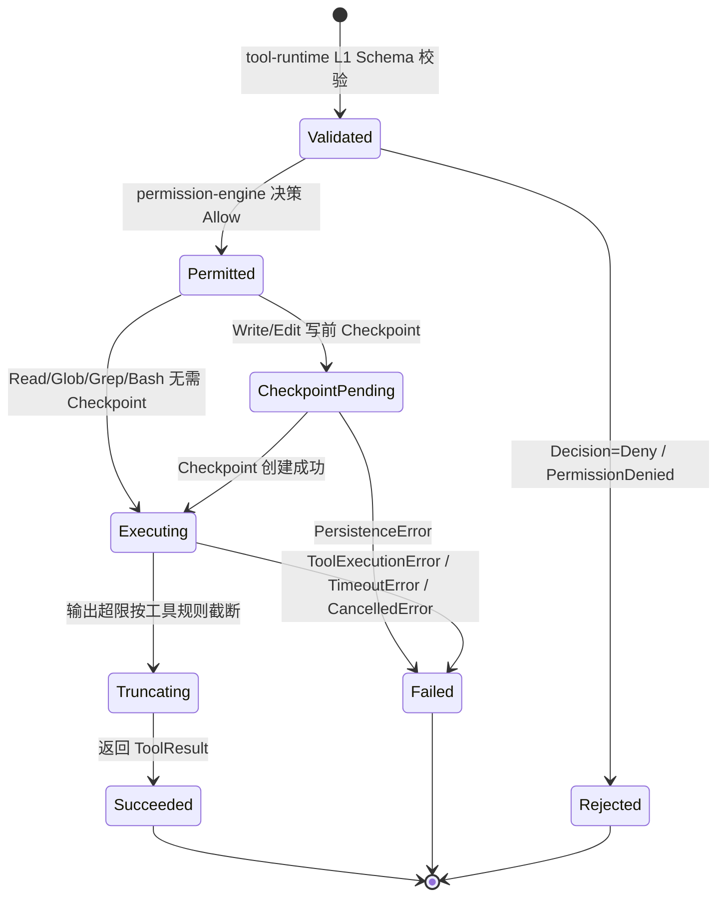
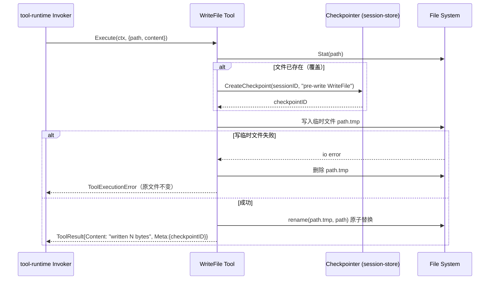

# Built-in Tools Spec

## 1. Module Info

| 字段 | 值 |
| --- | --- |
| Module ID | `builtin-tools` |
| Module Name | Built-in Tools |
| Status | Draft |
| Owner | ForgeCode 核心架构组（占位） |
| Dependencies | `tool-runtime`, `permission-engine`, `session-store` |
| Dependents | `runtime-core`（经 `tool-runtime` Registry 间接调用） |
| Related Requirements | FR-TOOL-101, FR-TOOL-102, FR-TOOL-103, FR-TOOL-104, FR-TOOL-105, FR-TOOL-106, FR-TOOL-001, FR-TOOL-003, NFR-LIMIT-001, NFR-RECOV-001, NFR-TEST-001 |
| Related ADRs | ADR-0004 |
| MVP | Yes |

## 2. Purpose

本模块提供 ForgeCode 单 Agent 闭环所需的六个内置工具：`ReadFile`、`WriteFile`、`EditFile`、`Bash`、`Glob`、`Grep`。它们是 Agent 观察与改造真实代码仓库的最小动作集合。模块只实现 **工具自身的输入解析、执行语义与输出整形**，所有跨工具的横切关注点（权限决策、Hook、截断编排、审计、超时编排）由 `tool-runtime` 的统一调用管线负责。本模块存在的意义是：把"读文件 / 写文件 / 精确编辑 / 执行命令 / 文件匹配 / 内容搜索"这些动作以 **统一 `Tool` 接口** 实现，使它们与 MCP 工具走同一管线（ADR-0004），从而天然受五层权限防御与审计约束。

## 3. Scope

- 实现六个工具，每个实现 `tool-runtime` 的 `Tool` 接口并暴露 `ToolDescriptor`（名称、JSON Schema、风险标注、权限要求、来源标记 `builtin`）。
- 提供一个 `RegisterBuiltins` 装配函数，把六个工具注册进 `tool-runtime` 的 `Registry`。
- `ReadFile`：分页读取、二进制识别、超大文件保护（FR-TOOL-101）。
- `WriteFile`：创建/覆盖语义，写前经 `session-store` 创建 Checkpoint，失败保持原文件不变（FR-TOOL-102）。
- `EditFile`：基于唯一匹配的精确局部替换并产出 Diff（FR-TOOL-103）。
- `Bash`：命令执行、超时、输出头尾保留、退出码与错误分类（FR-TOOL-104）。
- `Glob`：文件名模式匹配（FR-TOOL-105）。
- `Grep`：关键字与正则搜索、结果去重（FR-TOOL-106）。

## 4. Non-goals

- **不定义** `Tool` 接口、`ToolDescriptor`、`Registry`、`Invoker` 与调用管线本身——这些属于 `tool-runtime`。
- **不做** 权限决策（路径边界、Bash 危险分析、审批）——属于 `permission-engine`；本模块工具假设管线已在执行前完成 Permission 层。
- **不直接** 写 Event Store 或 Approval 记录——由 `tool-runtime` / `session-store` 负责。
- **不实现** Docker 沙箱执行——`Bash` 在 MVP 直接本地执行，沙箱化由 `sandbox`（V0.2）经管线接管。
- **不做** 工具结果到模型上下文的二次压缩——由 `context-manager` 负责（本模块只做工具内的原始截断/分页/去重）。
- **不实现** Worktree、Git 高级操作；`Bash` 仅是通用命令执行入口。

## 5. Responsibilities

- 为每个工具定义稳定的 `ToolDescriptor`：输入 JSON Schema、默认风险标注、权限要求声明（供 `permission-engine` 读取）。
- 在 `Execute` 中实现工具语义，返回结构化的 `ToolResult`（成功内容、是否被截断、元数据如行号范围/匹配数/退出码）。
- `ReadFile`：按 `offset`/`limit` 分页；检测二进制并拒绝返回乱码；对超大文件按字节上限保护。
- `WriteFile`：在覆盖既有文件前，经注入的 `Checkpointer` 创建 Checkpoint；通过临时文件 + 原子 rename 保证失败时原文件完整。
- `EditFile`：要求 `old_string` 在目标文件中唯一匹配，否则返回 `ValidationError`；成功后生成 unified diff 作为结果元数据；同样写前 Checkpoint。
- `Bash`：以子进程执行命令，强制 Deadline 超时，保留输出头尾（中间截断），返回退出码并据此分类错误。
- `Glob`：按 glob 模式匹配 Workspace 内文件，返回排序后的路径列表。
- `Grep`：按字符串/正则在文件集合内搜索，按 `file:line` 去重，受最大匹配数上限约束。
- 所有工具尊重 `context.Context` 取消，超出限制时返回明确错误分类而非无界增长（NFR-LIMIT-001）。

## 6. Public Interfaces

使用 Go 风格伪代码（本阶段不要求可编译）。`Tool` / `ToolDescriptor` / `ToolResult` 的权威定义在 `tool-runtime`，此处仅引用并给出内置工具的装配点。

```go
// 引用自 tool-runtime（本模块不定义）：
//   type Tool interface {
//       Descriptor() ToolDescriptor
//       Execute(ctx context.Context, raw json.RawMessage) (ToolResult, error)
//   }
//   type ToolDescriptor struct {
//       Name           string
//       InputSchema    json.RawMessage // JSON Schema
//       Source         string          // "builtin"
//       DefaultRisk    RiskLevel       // 引用 GLOSSARY: Low/Medium/High/Critical
//       PermissionReq  PermissionReq   // 读/写/执行声明，供 permission-engine 读取
//   }
//   type ToolResult struct {
//       Content   string
//       Truncated bool
//       Meta      map[string]any  // 行范围 / 退出码 / 匹配数 / diff 等
//   }

// 由 session-store 提供、注入本模块（写前 Checkpoint）：
type Checkpointer interface {
    CreateCheckpoint(ctx context.Context, sessionID, reason string) (checkpointID string, err error)
}

// 装配：把六个内置工具注册进 tool-runtime.Registry。
func RegisterBuiltins(reg toolruntime.Registry, deps Deps) error

type Deps struct {
    Checkpointer Checkpointer // WriteFile / EditFile 使用
    WorkspaceRoot string      // 仅用于相对路径解析；边界判定属 permission-engine
    Clock        Clock        // 注入式时钟，便于测试超时
    Limits       Limits       // 默认上限（可被配置覆盖）
}

// 各工具构造函数（每个实现 tool-runtime.Tool）：
func NewReadFileTool(d Deps) Tool
func NewWriteFileTool(d Deps) Tool
func NewEditFileTool(d Deps) Tool
func NewBashTool(d Deps) Tool
func NewGlobTool(d Deps) Tool
func NewGrepTool(d Deps) Tool

// 工具输入（JSON Schema 对应的 Go 结构示意）：
type ReadFileInput struct {
    Path   string `json:"path"`
    Offset int    `json:"offset,omitempty"` // 起始行（1-based）
    Limit  int    `json:"limit,omitempty"`  // 行数
}
type WriteFileInput struct {
    Path    string `json:"path"`
    Content string `json:"content"`
}
type EditFileInput struct {
    Path       string `json:"path"`
    OldString  string `json:"old_string"`  // 必须唯一匹配
    NewString  string `json:"new_string"`
}
type BashInput struct {
    Command   string `json:"command"`
    TimeoutMs int    `json:"timeout_ms,omitempty"`
}
type GlobInput struct {
    Pattern string `json:"pattern"`
    Root    string `json:"root,omitempty"`
}
type GrepInput struct {
    Pattern string `json:"pattern"`
    Path    string `json:"path,omitempty"`
    Regex   bool   `json:"regex,omitempty"`
}
```

## 7. Domain Model

本模块 **不拥有任何持久化实体**（见 `DATA_OWNERSHIP.md`，`builtin-tools` 列无主拥有实体）。涉及的实体均为他模块所有：

| 实体 / 值对象 | 拥有模块 | 本模块关系 |
| --- | --- | --- |
| `ToolDescriptor`、`Tool`、`ToolResult`、`ToolCall` 契约 | `tool-runtime` | 实现 / 产出 |
| `Checkpoint` | `session-store` | 经 `Checkpointer` 接口请求创建（不写库） |
| `Approval`、`Event` | `permission-engine` / `event-system` / `session-store` | 不接触（由管线处理） |
| `RiskLevel`（Low/Medium/High/Critical） | `permission-engine`（GLOSSARY 权威） | 在 Descriptor 中引用标注 |

工具内部值对象（非持久化）：`Page`（offset/limit/总行数）、`DiffHunk`（EditFile 产出）、`BashOutput`（head/tail/退出码/超时标记）、`Match`（file/line/列/文本，Grep 去重键为 `file:line`）。

## 8. State Machine

六个工具均为 **无状态、单次执行** 组件，无独立生命周期状态机（其执行被 `tool-runtime` 管线编排，受 Agent State 间接驱动）。此处给出单次工具调用在管线内的执行阶段视图（lifecycle of one invocation），用于界定本模块只负责 `Execute` 阶段：



> 说明：`Validated` / `Permitted` / `Rejected` 阶段由 `tool-runtime` 与 `permission-engine` 完成，本模块只实现 `CheckpointPending`（请求 Checkpointer）、`Executing`、`Truncating`、`Succeeded/Failed` 的工具内逻辑。

## 9. Core Flows

### 9.1 WriteFile 覆盖既有文件（核心写流程，含写前 Checkpoint 与失败回滚）



### 9.2 异常流程

- **ReadFile 二进制/超大文件**：检测到 NUL 字节或非文本编码 → 返回 `ValidationError`（"binary file, not readable"）；文件超过字节上限 → 提示使用 `offset/limit` 分页，返回 `ValidationError`，不读入全文。
- **EditFile 非唯一匹配**：`old_string` 在文件中出现 0 次或 ≥2 次 → `ValidationError`（命中次数写入错误信息），不修改文件、不创建 Checkpoint。
- **Bash 超时**：到达 Deadline → 终止子进程组 → 返回 `TimeoutError`，并保留已产生输出的头尾；非零退出码 → `ToolExecutionError`，退出码写入 `Meta`。
- **取消**：`ctx` 取消 → 各工具中断（Bash 杀子进程、Read/Grep 停止遍历）→ 返回 `CancelledError`。

## 10. Configuration

| Key | 默认值 | 作用域 | 敏感 | 说明 |
| --- | --- | --- | --- | --- |
| `builtin.read.maxBytes` | `2 MiB` | 全局 | 否 | ReadFile 单次读取字节上限（超大文件保护） |
| `builtin.read.defaultLimit` | `2000` | 全局 | 否 | ReadFile 未指定 limit 时的默认行数 |
| `builtin.read.binaryProbeBytes` | `8192` | 全局 | 否 | 二进制探测采样字节数（检测 NUL/非法 UTF-8） |
| `builtin.bash.timeoutMs` | `120000` | 全局 | 否 | Bash 默认超时（可被入参 `timeout_ms` 收窄） |
| `builtin.bash.maxTimeoutMs` | `600000` | 全局 | 否 | Bash 超时上限 |
| `builtin.bash.headBytes` | `16 KiB` | 全局 | 否 | 输出头部保留字节数 |
| `builtin.bash.tailBytes` | `16 KiB` | 全局 | 否 | 输出尾部保留字节数 |
| `builtin.grep.maxMatches` | `1000` | 全局 | 否 | Grep 最大匹配条数（超出截断） |
| `builtin.glob.maxResults` | `1000` | 全局 | 否 | Glob 最大返回路径数 |

## 11. Persistence

本模块自身 **不持久化** 任何数据。唯一与持久化相关的交互是 `WriteFile` / `EditFile` 在覆盖既有文件前，经注入的 `Checkpointer`（`session-store` 拥有）创建 Checkpoint；Checkpoint 的存储、Schema、迁移策略全部属 `session-store`（NFR-RECOV-001）。文件系统写入属外部副作用，不经 SQLite。无本模块独立迁移策略。

## 12. Concurrency

- 每个 `Tool` 实例无可变共享状态，`Execute` 可被并发调用；实例内不持锁。
- 取消传播：所有工具尊重传入的 `context.Context`；Bash 在取消/超时时终止整个子进程组，避免孤儿进程。
- `WriteFile` / `EditFile` 通过临时文件 + 原子 `rename` 实现单文件写的原子性；同一路径的并发写由上层（`tool-runtime` 串行化同 Session 工具调用）保证，本模块不提供跨进程文件锁。
- 幂等：恢复重放时工具 **不重新执行**（使用已记录的 `ToolResult`，见 `EVENT_MODEL.md`），因此本模块无需自身幂等保证。
- `go test -race` 下各工具并发执行应无数据竞争（NFR-TEST-001）。

## 13. Error Model

引用 `GLOSSARY.md` 标准错误分类：

| 错误类别 | 触发条件 | 调用方处理 |
| --- | --- | --- |
| `ValidationError` | 二进制文件读、超大文件未分页、EditFile 非唯一匹配、必填字段缺失 | 不可重试；作为 Observation 回模型，提示修正参数 |
| `ToolExecutionError` | 文件 IO 失败、Bash 非零退出、rename 失败 | 视情况可重试；退出码/原因写入 Meta |
| `TimeoutError` | Bash 超过 Deadline | 不自动重试；保留头尾输出 |
| `CancelledError` | `ctx` 取消 / 用户取消 | 终止当前工具，落 Cancelled 流程（由管线处理） |
| `PersistenceError` | 写前 Checkpoint 创建失败 | 中止写操作，原文件不变；上抛由管线落事件 |

> `PermissionDenied` / `ApprovalRequired` 由 `permission-engine` 在执行前产生，不在本模块抛出。

## 14. Security

- **信任边界**：工具入参来自 **模型输出（不可信）**；本模块假设 `tool-runtime` 管线已在 `Execute` 前完成 L1 校验与 L2/L3 权限决策。本模块 **不**自行做路径边界/Bash 危险判定，但仍：
  - 不把模型提供的内容当作可信指令；输出仅作为数据返回。
  - `ReadFile` 对二进制/超大文件拒绝，降低密钥文件/二进制被整体回灌上下文的风险（密钥目录拦截由 `permission-engine` L2 负责）。
- **攻击面**：路径穿越、符号链接逃逸、命令注入 —— 这些的 **决策** 属 `permission-engine`（L2/L3，RISK-006/007/008）；本模块仅以注入的 `WorkspaceRoot` 做相对路径拼接，不绕过管线。
- **敏感数据**：Bash 输出可能含密钥；本模块不写普通日志，结果交由 `telemetry` 脱敏（NFR-SEC-002）。
- **Checkpoint 兜底**：写类工具写前 Checkpoint，保证危险写入可 `/rewind`（NFR-RECOV-001）。
- **Bash 风险**：RISK-006 误判由 `permission-engine` 结构化分析缓解；本模块 `Bash` Descriptor 默认风险标注为 `High`，确保进入审批路径。

## 15. Observability

- **Log**：工具执行的结构化日志（工具名、耗时、结果大小、是否截断）经 `tool-runtime` → `telemetry`，敏感内容脱敏。
- **Metric**：每工具调用次数、平均耗时、截断率、错误分类分布（由管线统一上报）。
- **Audit Event**：`PreToolUse`（高风险 Bash）、`PostToolUse`、`ToolFailure` 由管线发布到 Event Bus；本模块只返回结构化结果供其填充。
- **Usage/Cost**：本模块不直接产生 Token/Cost；输出大小影响下游上下文成本，由 `context-manager` 计量。

## 16. Testing Strategy

- **Unit**：各工具输入解析、边界（空文件、单行、超大文件、二进制、glob 无匹配、grep 多匹配去重、EditFile 0/1/多匹配、Bash 退出码映射）。
- **Golden**：ReadFile 分页输出、EditFile 生成的 unified diff、Grep 去重结果与已知期望对比（FR-TOOL-101/103/106）。
- **Failure Injection**：WriteFile 临时文件写失败 / rename 失败 → 原文件不变；Checkpoint 创建失败 → 中止写；Bash 超时与被杀进程（FR-TOOL-102/104）。
- **Race**：`go test -race` 并发执行多工具（NFR-TEST-001）。
- **Contract**：六个工具均满足 `tool-runtime` 的 `Tool` 接口契约与 Descriptor schema 校验（ADR-0004）。
- **Security**：验证 Bash Descriptor 默认 High 风险进入审批；ReadFile 拒绝二进制/超大文件（配合 permission-engine 安全测试，RISK-006）。
- **Mock/Fake**：注入 Fake `Checkpointer`、Fake `Clock`、临时目录 FS。

## 17. Acceptance Criteria

- [ ] 六个工具均实现 `tool-runtime.Tool` 接口并经 `RegisterBuiltins` 注册成功，Descriptor 通过 schema 校验（FR-TOOL-001/004）。
- [ ] ReadFile 支持 offset/limit 分页，识别二进制并拒绝，超大文件触发保护提示分页（FR-TOOL-101）。
- [ ] WriteFile 覆盖既有文件前创建 Checkpoint，写失败时原文件字节级不变（Failure Test 通过）（FR-TOOL-102）。
- [ ] EditFile 仅在唯一匹配时替换，0/多匹配返回 `ValidationError`，成功产出 Diff（FR-TOOL-103）。
- [ ] Bash 支持超时终止、头尾输出保留、退出码与错误分类正确（FR-TOOL-104）。
- [ ] Glob 按模式返回排序路径并受 maxResults 限制（FR-TOOL-105）。
- [ ] Grep 支持正则、结果按 `file:line` 去重并受 maxMatches 限制（FR-TOOL-106）。
- [ ] 所有工具输出受显式上限约束，不会无界增长（NFR-LIMIT-001）；`go test -race` 通过（NFR-TEST-001）。

## 18. Risks

- **RISK-006**（Bash 安全分析误判）：本模块 `Bash` 默认 `High` 风险标注 + 进审批，缓解面由 `permission-engine` 承担；本模块责任是不绕过管线、不内联放行。

## 19. Open Questions

- ReadFile 的二进制识别阈值（NUL 比例 / 非法 UTF-8 比例）取值需在真实仓库语料上校准。
- EditFile 在含 CRLF/混合换行文件中的唯一匹配与 Diff 生成策略是否需要换行归一化（待 Golden 语料验证）。
- Bash 输出头尾保留的字节切分是否需按行边界对齐以避免半行乱码（待 UX 验证）。
