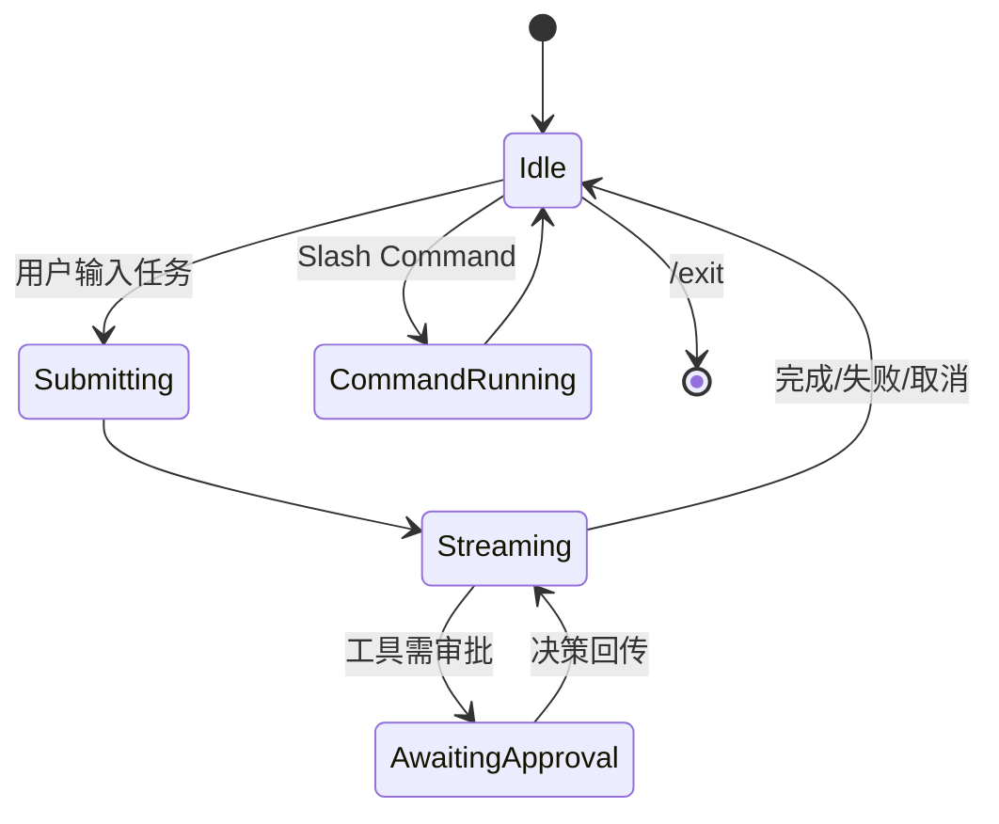

# cli Spec

## 1. Module Info

| 字段 | 值 |
| --- | --- |
| Module ID | `cli` |
| Module Name | CLI |
| Status | Draft |
| Owner | 架构组（占位） |
| Dependencies | runtime-core, extension-system, session-store, telemetry |
| Dependents | User |
| Related Requirements | FR-CLI-001..004 |
| Related ADRs | — |
| MVP | Yes |

## 2. Purpose
cli 是 ForgeCode 的交互入口：启动 Session、提交任务、流式渲染输出、处理审批交互、分派命令。它**只做渲染与分派**，不承载核心业务逻辑（避免"CLI 成为业务逻辑核心"反模式）。

## 3. Scope
- REPL 式交互：启动/提交/流式输出/审批。
- 内置固定逻辑命令的本地处理与分派。
- 将 Prompt/Skill 命令交 extension-system 展开为任务输入。
- 审批交互 UX（展示风险与命中原因，收集 Allow/Deny）。
- Session 列表与 Resume/Checkpoint/Rewind 入口。

## 4. Non-goals
- 不实现 Agent Loop（runtime-core）。
- 不实现命令/Hook/Skill 逻辑（extension-system）。
- 不做权限决策（permission-engine）。
- 不做复杂 TUI（第一版行/块输出，非目标）。

## 5. Responsibilities
- 解析用户输入：区分自然语言任务 vs Slash Command。
- 固定逻辑命令（/help /model /context /cost /clear /exit /resume /checkpoint /init /rewind）本地执行或分派。
- 渲染流式输出与工具调用/结果摘要。
- 审批提示：展示 telemetry/permission 提供的风险信息，回传决策。

## 6. Public Interfaces

```go
type App interface {
    Run(ctx context.Context) error
}

type REPL struct {
    Runtime   runtimecore.Runtime
    Commands  extension.CommandRegistry
    Store     sessionstore.Store
    Renderer  Renderer
}

type Renderer interface {
    Stream(chunk OutputChunk)
    ToolActivity(call ToolView)
    ApprovalPrompt(req ApprovalView) Decision // 同步收集用户决策
}
```

## 7. Domain Model
- `OutputChunk`、`ToolView`、`ApprovalView`、`Decision`（复用 permission-engine Effect 语义）。
- 命令输入解析结果：`TaskInput | CommandInvocation`。
- 本模块不拥有持久实体。

## 8. State Machine
REPL 交互态：



## 9. Core Flows
- **提交任务**：输入 → runtime-core.Submit → 订阅流式事件 → 渲染。
- **审批**：收到 AwaitingApproval → ApprovalPrompt 展示风险/命中原因 → 回传 Decision。
- **固定命令**：/context /cost 直接查询本地状态渲染，不经模型（FR-CLI-002）。
- **Prompt/Skill 命令**：交 extension-system 展开 → 作为任务提交。
- **Resume/Rewind**：列出 Session/Checkpoint → 调 runtime-core/session-store。

## 10. Configuration

| Key | 默认值 | 作用域 | 敏感 | 说明 |
| --- | --- | --- | --- | --- |
| `cli.color` | auto | 全局 | 否 | 彩色输出 |
| `cli.stream` | true | 全局 | 否 | 流式渲染 |
| `cli.default_model` | 配置 | 全局 | 否 | 默认模型 |

## 11. Persistence
不持久化；经 session-store 读取 Session/Checkpoint。

## 12. Concurrency
- 主交互单线程；流式渲染消费事件 channel。
- 取消（Ctrl-C）→ context 取消 → runtime-core.Cancel。
- 审批为同步阻塞收集。

## 13. Error Model
向用户友好呈现底层错误分类（GLOSSARY）：ProviderError/ToolExecutionError/PermissionDenied/CancelledError 等，不泄露敏感细节。

## 14. Security
- 不在终端回显密钥/Token。
- 审批展示足够信息但脱敏原始敏感参数。
- 固定命令本地执行，不把命令字符串注入模型。

## 15. Observability
- 用户操作经 telemetry 记录（命令、审批决策计数）。
- 渲染错误本地日志。

## 16. Testing Strategy
- Unit：输入解析（任务 vs 命令）、命令分派。
- Integration：与 runtime-core 跑通提交→流式→审批→完成。
- Golden：渲染输出快照。
- 依赖检查：cli 不含核心业务逻辑（FR-CLI-003）。

## 17. Acceptance Criteria
- [ ] 任务与 Slash Command 正确区分分派。
- [ ] 固定命令本地执行不经模型。
- [ ] 审批提示展示风险/命中原因并回传决策。
- [ ] Ctrl-C 触发取消并传播。
- [ ] cli 不实现 Agent Loop/权限/命令逻辑（依赖与代码审查证明）。

## 18. Risks
CLI 成为业务核心（反模式，靠依赖约束规避）。

## 19. Open Questions
- CLI 框架选型（OPEN_QUESTIONS Q5）。
- 是否需要最小 TUI 用于审批/流式（第一版倾向行式）。
