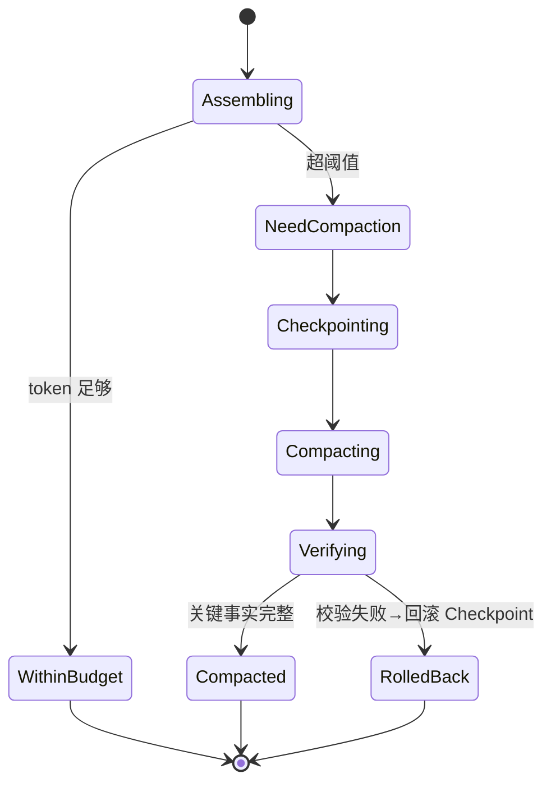

# context-manager Spec

## 1. Module Info

| 字段 | 值 |
| --- | --- |
| Module ID | `context-manager` |
| Module Name | Context Manager |
| Status | Draft |
| Owner | 架构组（占位） |
| Dependencies | model-provider, session-store, telemetry |
| Dependents | runtime-core |
| Related Requirements | FR-CONTEXT-001..006 |
| Related ADRs | ADR-0002（Checkpoint） |
| MVP | Yes |

## 2. Purpose
context-manager 负责分层组装发往模型的上下文、估算 Token、管理 Token/Cost 预算，并在接近窗口时进行可恢复的压缩（Compaction），同时保护关键事实不丢失。

## 3. Scope
- 分层上下文模型与组装。
- Token 估算、Reserved Output、Token/Cost Budget 计算。
- 工具输出截断（Bash 头尾保留、Grep 去重、ReadFile 分页、JSON 提取、Observation 压缩）。
- 自动 Compaction 与手动 `/compact`，压缩前 Checkpoint，压缩后可恢复。
- 关键事实保护与压缩错误检测/回滚。

## 4. Non-goals
- 不调用模型生成回复（runtime-core）。
- 不持久化（Checkpoint 经 session-store）。
- 不做记忆检索本身（memory-system 提供 RetrievedMemory 层内容）。
- 不定义 Token 计费费率（telemetry/Provider 元数据）。

## 5. Responsibilities
- 按层组装请求消息，遵守窗口与 Reserved Output。
- 维护 Token/Cost 预算并向 runtime-core 暴露超限信号。
- 截断/压缩工具输出与历史。
- 压缩时保护关键事实清单。
- 检测压缩异常并触发回滚到 PreCompact Checkpoint。

## 6. Public Interfaces

```go
type Builder interface {
    Build(ctx context.Context, in BuildInput) (PreparedContext, error)
}

type Compactor interface {
    Compact(ctx context.Context, sessionID string) (CompactResult, error)
    Verify(result CompactResult) error // 关键事实校验
}

type TokenEstimator interface {
    Estimate(messages []Message, model ModelInfo) (tokens int)
}

type Budget struct {
    TokenLimit, TokenUsed int
    CostLimitUSD, CostUsed float64
    ReservedOutput int
}

// 上下文分层
type Layer int
const (
    SystemContext Layer = iota
    ProjectInstructions
    ActiveSkill
    UserTask
    CurrentPlan
    WorkingMemory
    RecentMessages
    ToolResults
    RetrievedMemory
    CompactedHistory
)
```

## 7. Domain Model
- `PreparedContext`（按层有序消息 + token 统计）。
- `Budget`、`ModelInfo`（窗口/费率，来自 model-provider）。
- `CompactResult`（压缩摘要 + 保留的关键事实 + 覆盖的 Sequence 范围）。
- `KeyFacts`（用户目标、计划、已完成步骤、关键文件/行号、权限决定、失败尝试、未解决问题、下一步）。

## 8. State Machine
压缩子流程（无持久实体）：



## 9. Core Flows
- **组装**：收集各层内容 → 估算 token → 若超（窗口 − Reserved Output）触发压缩 → 否则直接返回。
- **截断**：ToolResults 层对 Bash 保留头尾、Grep 去重、ReadFile 分页、长 JSON 提取关键字段。
- **压缩**：PreCompact Checkpoint → 将旧 RecentMessages/ToolResults 摘要为 CompactedHistory，保留 KeyFacts → Verify → PostCompact。
- **回滚**：Verify 失败（KeyFacts 缺失）→ 回滚 Checkpoint，跳过本次压缩并告警（RISK-009）。
- **手动**：`/compact` 触发同流程。

## 10. Configuration

| Key | 默认值 | 作用域 | 敏感 | 说明 |
| --- | --- | --- | --- | --- |
| `ctx.reserved_output_ratio` | 0.2 | Session | 否 | 预留输出占窗口比例 |
| `ctx.compact_trigger_ratio` | 0.8 | Session | 否 | 触发压缩的窗口占用阈值 |
| `ctx.bash_head_tail_lines` | 50/50 | 全局 | 否 | Bash 输出头尾保留行数 |
| `ctx.readfile_page_lines` | 400 | 全局 | 否 | ReadFile 分页大小 |
| `ctx.token_estimator` | heuristic | 全局 | 否 | 估算方式（OPEN_QUESTIONS Q4） |

## 11. Persistence
本模块不直接持久化；压缩前 Checkpoint 与压缩结果经 session-store 落事件（PreCompact/PostCompact）。

## 12. Concurrency
- 单 Session 上下文组装在 Loop 中串行（与 runtime-core 同步）。
- TokenEstimator 无状态、可并发。
- 取消经 context 传播。
- 幂等：同输入组装结果确定。

## 13. Error Model
`ValidationError`（层内容非法）、`RecoveryError`（回滚失败）、`ProviderError`（估算依赖模型元数据缺失时降级）。压缩 Verify 失败不是错误而是触发回滚路径。

## 14. Security
- 工具输出/检索记忆为不可信输入，截断并保留来源标注，降低 Tool Output Injection（SECURITY_MODEL）。
- 压缩摘要不得引入未经验证的"指令"内容。
- KeyFacts 不含密钥明文（脱敏）。

## 15. Observability
- 事件：PreCompact、PostCompact、CheckpointCreated（经 session-store）。
- 指标：每轮 token 估算、压缩次数、压缩前后 token、回滚次数、各层占比。

## 16. Testing Strategy
- Unit：分层组装、预算计算、截断规则。
- Golden：Bash 头尾/Grep 去重/ReadFile 分页/Observation 压缩固定输入→输出。
- Failure Injection：压缩后 KeyFacts 缺失→回滚。
- Integration：与 runtime-core Compacting 状态联动、与 session-store Checkpoint。

## 17. Acceptance Criteria
- [ ] 组装遵守窗口 − Reserved Output。
- [ ] Bash 头尾保留、Grep 去重、ReadFile 分页按配置生效。
- [ ] 超阈值自动触发压缩，手动 `/compact` 可触发。
- [ ] 压缩后 KeyFacts（目标/计划/文件行号/未完成任务/权限决定）完整保留。
- [ ] Verify 失败回滚到 PreCompact Checkpoint。

## 18. Risks
RISK-009（压缩丢信息）。

## 19. Open Questions
- Token 估算精度与是否引入精确 tokenizer（Q4）。
- 压缩用模型摘要还是规则摘要（成本 vs 质量），M3 评估。
- CompactedHistory 与 RetrievedMemory 的边界（避免重复）。
