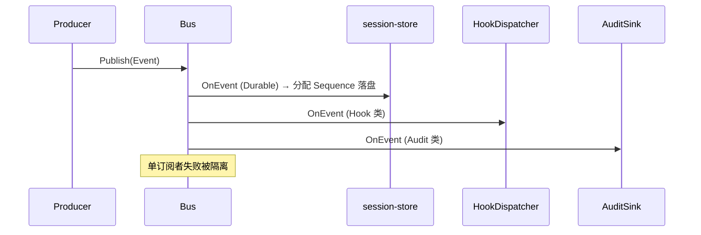

# event-system Spec

## 1. Module Info

| 字段 | 值 |
| --- | --- |
| Module ID | `event-system` |
| Module Name | Event System |
| Status | Draft |
| Owner | 架构组（占位） |
| Dependencies | telemetry |
| Dependents | runtime-core, session-store, tool-runtime, permission-engine, extension-system, mcp-client, memory-system, agent-orchestration, git-worktree |
| Related Requirements | FR-EVENT-001..003 |
| Related ADRs | ADR-0011 |
| MVP | Yes |

## 2. Purpose
event-system 拥有全系统唯一的 Event Envelope 与 EventType 定义，并提供进程内 Event Bus。它是事件驱动 Runtime 的基础，保证持久化、恢复、审计、Hook 共用同一事件格式，消除"多个模块各自维护事件格式"的反模式。

## 3. Scope
- 定义 `Event` Envelope（见 EVENT_MODEL.md，权威）与 `EventType` 枚举。
- 进程内 Event Bus：发布/订阅、按订阅者有序投递、错误隔离。
- 事件分类标注（Durable/Recovery/Audit/Hook/Ephemeral）。
- 提供订阅者注册（session-store、telemetry AuditSink、extension-system HookDispatcher 经此订阅）。

## 4. Non-goals
- 不持久化事件（session-store）。
- 不实现 Hook 逻辑（extension-system）。
- 不实现审计落库（telemetry）。
- 不分配 Sequence（由 session-store 在 append 时分配）。

## 5. Responsibilities
- 拥有 Event 格式与 EventType 枚举的单一真相源。
- 提供 Bus.Publish/Subscribe。
- 保证单订阅者投递有序、订阅者间错误隔离。
- 标注事件分类供消费方过滤。

## 6. Public Interfaces

```go
type Event struct {
    EventID       string
    EventType     EventType
    Timestamp     time.Time
    SchemaVersion int
    SessionID     string
    AgentID       string
    TaskID        string
    TeamID        string
    CorrelationID string
    CausationID   string
    Sequence      int64           // 由 session-store 分配
    Payload       json.RawMessage
}

type Bus interface {
    Publish(ctx context.Context, e Event) error
    Subscribe(filter SubscriptionFilter, s Subscriber) (Unsubscribe, error)
}

type Subscriber interface {
    OnEvent(ctx context.Context, e Event) error
}

type SubscriptionFilter struct {
    Types     []EventType
    Class     EventClass // Durable|Recovery|Audit|Hook|Ephemeral
}
```

## 7. Domain Model
- `Event`、`EventType`（权威枚举，见 EVENT_MODEL.md）、`EventClass`、`SubscriptionFilter`、`Subscriber`。
- 本模块拥有事件**格式契约**；存储归 session-store。

## 8. State Machine
无生命周期实体。订阅生命周期：`Subscribed → (投递) → Unsubscribed`。

## 9. Core Flows
- **发布**：Producer 构造 Event（不含 Sequence）→ Publish → Bus 投递给匹配订阅者；session-store 订阅 Durable 类并分配 Sequence 落盘。
- **订阅有序**：单订阅者按接收顺序串行处理。
- **错误隔离**：订阅者 OnEvent 返回错误，记录并继续投递其他订阅者，不影响发布方主流程（Hook 可阻断决策走 extension-system 同步路径，见 ADR-0011）。



## 10. Configuration

| Key | 默认值 | 作用域 | 敏感 | 说明 |
| --- | --- | --- | --- | --- |
| `event.bus_buffer` | 256 | 全局 | 否 | Bus 投递缓冲 |
| `event.subscriber_timeout` | 5s | 全局 | 否 | 订阅者处理超时 |

## 11. Persistence
本模块不持久化。Sequence 由 session-store 分配，体现"格式 vs 存储"分离（DATA_OWNERSHIP）。

## 12. Concurrency
- Bus 线程安全，支持并发 Publish。
- 单订阅者串行有序；不同订阅者可并发。
- 取消经 context 传播到订阅者。
- 幂等由消费方（session-store EventID 去重）保证。

## 13. Error Model
`ValidationError`（Envelope 字段缺失）、`TimeoutError`（订阅者超时）。订阅者错误被隔离记录，不抛回发布方（同步阻断类除外）。

## 14. Security
- 事件 Payload 可能含敏感数据：脱敏责任在 telemetry 落地时，event-system 不在普通日志打印 Payload。
- Hook 经此订阅但不可绕过事件总线（ADR-0011）。

## 15. Observability
- 指标：发布速率、订阅者处理耗时、订阅者错误数、丢弃 Ephemeral 数。
- 自身日志经 telemetry。

## 16. Testing Strategy
- Unit：发布/订阅/过滤、分类标注。
- Race：并发发布与订阅 `go test -race`。
- Contract：Event Envelope 字段与 EVENT_MODEL.md 一致。
- Failure Injection：订阅者 panic/超时隔离。

## 17. Acceptance Criteria
- [ ] Event 字段与 EVENT_MODEL.md 完全一致。
- [ ] 单订阅者投递有序。
- [ ] 一个订阅者失败不影响其他订阅者与发布方。
- [ ] 按 Type/Class 过滤订阅生效。
- [ ] 并发发布 race 测试通过。

## 18. Risks
RISK-020（接口漂移，事件格式是最关键契约）。

## 19. Open Questions
- 同步阻断型订阅（Hook 决策）与异步通知型订阅的接口是否需分离（影响 extension-system 集成）。
- Ephemeral 事件是否需背压策略。
