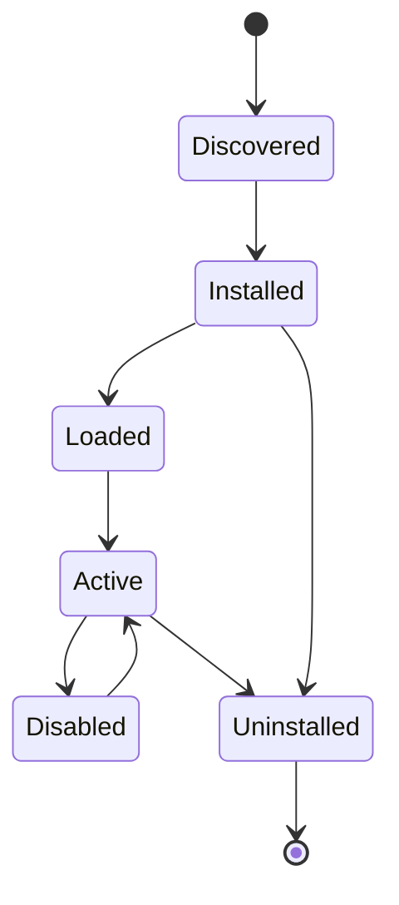
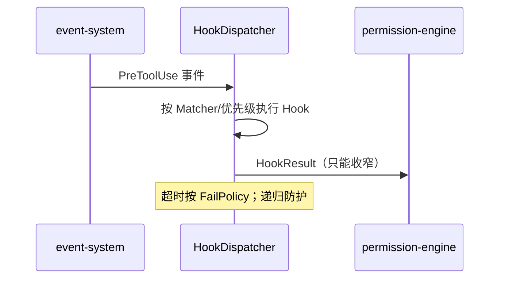

# extension-system Spec

## 1. Module Info

| 字段 | 值 |
| --- | --- |
| Module ID | `extension-system` |
| Module Name | Extension System（Skill + Slash Command + Hook） |
| Status | Draft |
| Owner | 架构组（占位） |
| Dependencies | tool-runtime, permission-engine, event-system, mcp-client |
| Dependents | cli, runtime-core |
| Related Requirements | FR-CMD-001/002, FR-CMD-100, FR-HOOK-001..003, FR-SKILL-001..004 |
| Related ADRs | ADR-0010, ADR-0011 |
| MVP | Partial（Command + Hook 为 MVP；Skill 为 V0.2） |

## 2. Purpose
extension-system 统一承载三类可扩展能力：Slash Command、Hook、Skill。它们共享扩展加载、来源追踪、权限声明与冲突处理机制，避免散落实现（Hook 散落回调、命令逻辑混入 CLI）。

## 3. Scope
- Slash Command 框架：固定逻辑/Prompt/Skill 命令；内置/用户/项目级；参数校验、Alias、Help、冲突、Command Hook、权限要求。
- Hook 系统（基于统一 Event Bus）：订阅生命周期事件，Internal Go/Shell/HTTP，结果 Allow/Deny/Ask/Modify/Continue，顺序/优先级/Matcher/Timeout/失败策略/递归防护/审计。
- Skill 包系统：SKILL.md+manifest.yaml+资源；安装/卸载/升级/版本锁定/Discovery/显式+自动选择/延迟加载；Tool/MCP/权限依赖检查；冲突；测试；来源追踪。
- 候选 Skill 自动生成流水线（轨迹→候选→静态检查→回放评测→人工审批→安装）。

## 4. Non-goals
- 不实现 Event Bus（event-system）、不做权限决策（permission-engine，但提交决策参与合并）。
- 不实现 Agent Loop（runtime-core）。
- 不实现回放评测引擎（evaluation，被调用）。
- 不实现 CLI 渲染（cli）。

## 5. Responsibilities
- 拥有 SkillMetadata、Command/Hook 注册表。
- HookDispatcher 经 event-system 订阅生命周期事件并按规则执行 Hook。
- 保证 Skill/Hook 不可扩大自身权限（提交给 permission-engine 的声明只能收窄）。
- 命令分派：固定逻辑本地、Prompt/Skill 展开为任务输入。
- 候选 Skill 在审批前不得 Active（ADR-0010）。

## 6. Public Interfaces

```go
type CommandRegistry interface {
    Register(c Command) error            // 冲突/Alias 处理
    Resolve(input string) (Invocation, error)
    Help() []CommandHelp
}

type Command struct {
    Name       string
    Kind       CommandKind // Fixed | Prompt | Skill
    Args       []ArgSpec
    Permission PermissionHint
    Run        func(ctx, Args) (Outcome, error) // Fixed 用
}

type HookDispatcher interface {  // 实现 eventsystem.Subscriber
    OnEvent(ctx context.Context, e eventsystem.Event) (HookResult, error)
    RegisterHook(h Hook) error
}

type Hook struct {
    Match    HookMatcher
    Type     HookType   // InternalGo | Shell | HTTP
    Priority int
    Timeout  time.Duration
    OnFail   FailPolicy // FailClosed | FailOpen
}

type SkillManager interface {
    Install(ref SkillRef) error
    Uninstall(name string) error
    Discover(task TaskHint) []SkillMetadata
    Load(name string) (Skill, error)  // 延迟加载 + 依赖检查
}
```

## 7. Domain Model
- `Command`/`CommandKind`、`Hook`/`HookType`/`HookResult`/`FailPolicy`/`HookMatcher`。
- `SkillMetadata`（name、version、来源、权限声明、Tool/MCP 依赖、Skill State）。
- `SkillCandidate`（候选状态：Candidate→StaticChecked→Replayed→Approved→Installed）。
- Skill State 枚举见 GLOSSARY。本模块拥有 SkillMetadata 与注册表。

## 8. State Machine
Skill 生命周期：



候选：`Candidate → StaticChecked → Replayed → Approved → Installed`（未 Approved 不得 Active）。

## 9. Core Flows
- **固定命令**：Resolve → Run（本地，不经模型）。
- **Prompt/Skill 命令**：Resolve → 展开为任务输入 → 交 runtime-core。
- **Hook 决策**：event-system 投递 PreToolUse 等 → HookDispatcher 按 Matcher/优先级执行 → 合并 HookResult（不可提权，提交 permission-engine）。
- **Skill 加载**：Discover → 依赖检查（Tool/MCP/权限）→ 延迟加载 → 注入 ActiveSkill 上下文层。
- **候选生成**：成功轨迹 → 提取 → 候选 → 静态检查 → evaluation 回放 → 人工审批 → 安装。



## 10. Configuration

| Key | 默认值 | 作用域 | 敏感 | 说明 |
| --- | --- | --- | --- | --- |
| `ext.hook_timeout` | 5s | 全局 | 否 | Hook 超时 |
| `ext.hook_default_failpolicy` | FailClosed（安全事件）| 全局 | 否 | 失败策略 |
| `ext.skill_paths` | user/project/builtin | 全局 | 否 | Skill 搜索路径 |
| `ext.allow_shell_hooks` | false | 全局 | 是 | 是否允许 Shell Hook |
| `ext.allow_http_hooks` | false | 全局 | 是 | 是否允许 HTTP Hook |

## 11. Persistence
拥有 SkillMetadata（SQLite 索引 + 文件系统包）；Command/Hook 注册为内存 + 配置加载。候选 Skill 状态持久化。

## 12. Concurrency
- HookDispatcher 对单事件按优先级串行执行 Hook；不同事件可并发。
- 递归防护：Hook 触发的操作不得无限触发同类 Hook（深度计数）。
- Skill 加载延迟且幂等。
- 取消经 context 传播到 Shell/HTTP Hook。

## 13. Error Model
`ValidationError`（命令参数/manifest 非法）、`TimeoutError`（Hook 超时）、`PermissionDenied`（Skill 声明超权被拒）、`ConflictError`（命令/Skill 冲突）、`ToolExecutionError`（Shell Hook 失败）。

## 14. Security
- Hook 不可绕过事件总线、不可静默提权（ADR-0011, RISK-012）。
- Shell/HTTP Hook 默认禁用，启用需显式配置并审计、受 Timeout/沙箱约束。
- Skill 权限声明只能收窄；依赖检查防止越权工具调用。
- 候选 Skill 未经评测+审批不得生效（ADR-0010）。
- 来源追踪：所有扩展记录来源（builtin/user/project/auto-gen）。

## 15. Observability
- 事件：UserPromptSubmit、Pre/PostToolUse（Hook 消费）、MemoryRead/Write、SubAgentStart/Stop 等订阅。
- 指标：Hook 执行次数/超时/失败、命令调用、Skill 加载/冲突。
- 审计：Hook 决策、Skill 安装/审批。

## 16. Testing Strategy
- Unit：命令解析/冲突/Alias、Hook 优先级合并、manifest 校验。
- Security：Hook 提权尝试被拒、Skill 越权声明被拒、Shell/HTTP Hook 沙箱。
- Integration：HookDispatcher 与 event-system + permission-engine、Skill 加载注入上下文。
- Eval：候选 Skill 回放（FR-SKILL-004，依赖 evaluation）。
- Contract：HookResult 合并规则。

## 17. Acceptance Criteria
- [ ] 固定命令本地执行不经模型；Prompt/Skill 命令展开为任务。
- [ ] Hook 按优先级/Matcher 执行，超时按 FailPolicy，递归被防护。
- [ ] Hook 与 Skill 无法扩大权限（提交 permission-engine 仅收窄）。
- [ ] Skill 依赖（Tool/MCP/权限）检查与延迟加载生效。
- [ ] 候选 Skill 未审批不得 Active。
- [ ] 三个标杆命令 /review-pr /review-sql /review-k8s 已注册（FR-CMD-100）。

## 18. Risks
RISK-012（Hook 任意代码）、RISK-010（候选污染，配合 memory）。

## 19. Open Questions
- Hook 同步阻断 vs 异步通知的订阅接口（与 event-system OPEN_QUESTIONS 联动）。
- Skill 包签名/校验机制是否纳入第一版。
- Agent 自动选择 Skill 的触发与防滥用策略。
