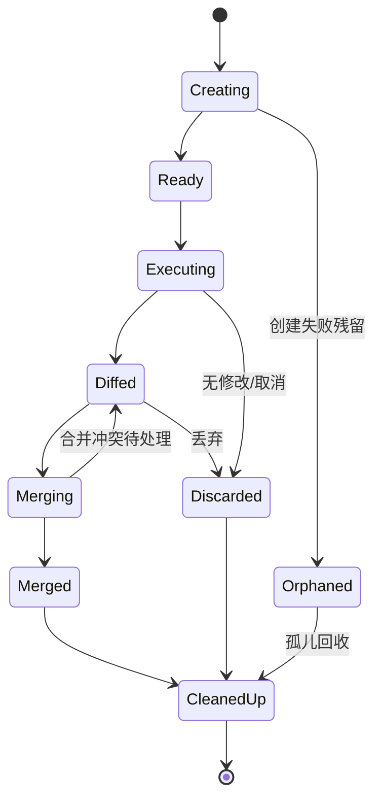

# git-worktree Spec

## 1. Module Info

| 字段 | 值 |
| --- | --- |
| Module ID | `git-worktree` |
| Module Name | Git Worktree |
| Status | Draft |
| Owner | 架构组（占位） |
| Dependencies | event-system, telemetry |
| Dependents | agent-orchestration |
| Related Requirements | FR-WORKTREE-001..003 |
| Related ADRs | ADR-0008 |
| MVP | No（V0.3） |

## 2. Purpose
git-worktree 管理用于并行写任务隔离的 Git Worktree：创建临时分支与 Worktree、在隔离目录执行、生成 Diff、合并或丢弃、清理与孤儿回收。它使并行写 Agent 互不干扰（ADR-0008），且不将 Worktree 逻辑混入 Git 工具。

## 3. Scope
- Worktree 生命周期：临时分支、创建、执行、测试、Diff、可选 Commit、提交审核、Merge/Cherry-pick/Discard、清理。
- 边界条件处理：主仓未提交修改、分支/路径冲突、无修改、同文件冲突、合并冲突、未跟踪文件、测试失败、清理失败、目录占用、取消回收。
- 崩溃后孤儿 Worktree 清理与审计。

## 4. Non-goals
- 不实现通用 Git 工具（builtin-tools 的 Bash 可执行 git，但 Worktree 编排在此）。
- 不决定何时并行（agent-orchestration）。
- 不做权限决策（permission-engine）。

## 5. Responsibilities
- 拥有 Worktree 登记表（Worktree State 见 GLOSSARY）。
- 封装 git CLI 或 go-git（OPEN_QUESTIONS Q3）执行 Worktree 操作。
- 生成隔离目录 Diff，支持合并/丢弃。
- 启动时扫描并清理孤儿 Worktree。
- 产生 WorktreeCreate/Remove 审计事件。

## 6. Public Interfaces

```go
type WorktreeManager interface {
    Create(ctx context.Context, spec WorktreeSpec) (*Worktree, error)
    Diff(ctx context.Context, id string) (Diff, error)
    Merge(ctx context.Context, id string, strategy MergeStrategy) (MergeResult, error)
    Discard(ctx context.Context, id string) error
    Cleanup(ctx context.Context, id string) error
    ScanOrphans(ctx context.Context) ([]Worktree, error)
}

type WorktreeSpec struct {
    BaseRef    string
    BranchName string  // 临时分支，冲突自动加后缀
    Path       string  // 隔离路径，冲突检测
}

type Worktree struct {
    ID, Path, Branch string
    State WorktreeState
}

type MergeStrategy int // Merge | CherryPick
```

## 7. Domain Model
- `Worktree`、`WorktreeSpec`、`Diff`、`MergeStrategy`、`MergeResult`。
- Worktree State 枚举（见 GLOSSARY）。
- 本模块拥有 Worktree 登记表。

## 8. State Machine



## 9. Core Flows
- **创建执行**：主仓未提交修改检查 → 创建临时分支（冲突加后缀）→ 创建 Worktree（路径冲突检测）→ 在隔离目录执行（agent-orchestration 驱动）→ 运行测试 → Diff。
- **审核合并**：Diffed → 提交主 Agent 审核 → Merge/Cherry-pick；冲突回到 Diffed 待处理（提交 Lead）。
- **丢弃/无修改**：无修改或取消 → Discard。
- **清理**：删除 Worktree 与临时分支；占用/失败重试。
- **孤儿回收**：启动时 ScanOrphans → 清理崩溃残留 → WorktreeRemove 审计。

## 10. Configuration

| Key | 默认值 | 作用域 | 敏感 | 说明 |
| --- | --- | --- | --- | --- |
| `worktree.root` | `.forgecode/worktrees` | 仓库 | 否 | Worktree 根目录 |
| `worktree.branch_prefix` | `forge/wt-` | 仓库 | 否 | 临时分支前缀 |
| `worktree.cleanup_on_cancel` | true | 全局 | 否 | 取消时回收 |
| `worktree.orphan_scan_on_start` | true | 全局 | 否 | 启动扫描孤儿 |

## 11. Persistence
拥有 Worktree 登记表（SQLite），记录路径/分支/状态/所属 Agent，支持孤儿回收。Worktree 本体在文件系统。

## 12. Concurrency
- 多 Worktree 并发，各自独立目录与分支。
- 同文件并行修改经独立 Worktree 隔离，合并阶段串行处理冲突。
- 取消经 context → 停止执行 → 回收。
- 登记表写串行化。

## 13. Error Model
`ConflictError`（分支/路径/合并冲突）、`SandboxError`（不适用）、`PersistenceError`（登记表）、`CancelledError`、`ToolExecutionError`（git 操作失败）、`RecoveryError`（孤儿回收失败）。

## 14. Security
- Worktree 在仓库受控根目录下，受 permission-engine 路径边界约束。
- 临时分支命名隔离，避免污染主分支。
- 合并前需主 Agent 审核（不自动合并未审查变更）。
- Worktree 操作审计（WorktreeCreate/Remove）。

## 15. Observability
- 事件：WorktreeCreate、WorktreeRemove。
- 指标：活跃 Worktree 数、孤儿回收数、合并冲突数、清理失败数。

## 16. Testing Strategy
- Integration：真实 git 仓库的创建/Diff/合并/清理。
- Unit：分支命名冲突、路径冲突、登记表。
- Failure Injection：主仓未提交、合并冲突、清理失败、目录占用、取消、崩溃孤儿。
- Recovery：崩溃后 ScanOrphans 清理。

## 17. Acceptance Criteria
- [ ] 创建临时分支与 Worktree，路径/分支冲突自动处理。
- [ ] 主仓未提交修改被检测并按策略处理。
- [ ] Diff 生成、Merge/Cherry-pick/Discard 可用，合并冲突回到待处理。
- [ ] 无修改/取消时正确丢弃回收。
- [ ] 崩溃后孤儿 Worktree 被扫描清理（RISK-014）。
- [ ] Worktree 操作产生审计事件。

## 18. Risks
RISK-014（孤儿资源）。

## 19. Open Questions
- git CLI vs go-git（Q3，Worktree 支持差异）。
- 主仓未提交修改的默认处理（stash vs 拒绝）。
- 多 Worktree 同时合并的串行化粒度。
