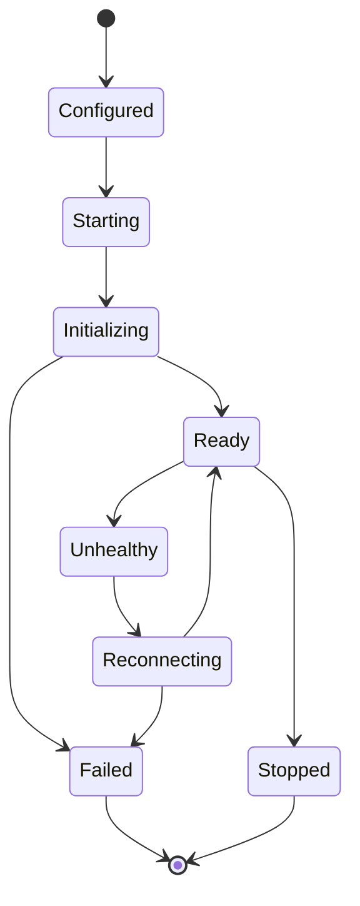

# mcp-client Spec

## 1. Module Info

| 字段 | 值 |
| --- | --- |
| Module ID | `mcp-client` |
| Module Name | MCP Client |
| Status | Draft |
| Owner | 架构组（占位） |
| Dependencies | tool-runtime, permission-engine, event-system |
| Dependents | extension-system, runtime-core |
| Related Requirements | FR-MCP-001..005 |
| Related ADRs | ADR-0004 |
| MVP | No（V0.2） |

## 2. Purpose
mcp-client 实现 MCP 协议客户端，可挂载外部 MCP Server，将其 Tools/Resources/Prompts 接入 ForgeCode。它将 MCP 工具映射为统一 ToolDescriptor，经 tool-runtime 同一管线与权限引擎执行，绝不绕过权限。

## 3. Scope
- Server 生命周期、能力协商、健康检查、重连。
- stdio 与 Streamable HTTP transport。
- tools/list、tools/call、resources/list+read、prompts/list+get。
- Namespace、名称冲突、Schema 转换为统一 Descriptor、输出大小限制。
- 信任级别、每工具权限等级、审计、外部 Prompt/Resource 安全边界。

## 4. Non-goals
- 不实现 MCP Server。
- 不实现统一管线/权限（tool-runtime/permission-engine，仅接入）。
- 不假设任何 MCP Server 可信。

## 5. Responsibilities
- 拥有 MCP Server 连接态（见 MCP Server State 枚举）。
- 注册 MCP 工具到 tool-runtime Registry（统一 Descriptor + Namespace）。
- 限制 MCP 工具输出大小、标注信任级别。
- 将外部 Prompt/Resource 作为不可信输入隔离。
- 产生 MCP 相关审计事件。

## 6. Public Interfaces

```go
type MCPClient interface {
    AddServer(ctx context.Context, cfg ServerConfig) (ServerHandle, error)
    RemoveServer(ctx context.Context, id string) error
    Health(id string) ServerState
}

type ServerHandle interface {
    ListTools(ctx context.Context) ([]toolruntime.ToolDescriptor, error)
    CallTool(ctx context.Context, name string, input json.RawMessage) (toolruntime.ToolResult, error)
    ListResources(ctx context.Context) ([]Resource, error)
    ReadResource(ctx context.Context, uri string) (ResourceContent, error)
    ListPrompts(ctx context.Context) ([]PromptDef, error)
    GetPrompt(ctx context.Context, name string, args map[string]any) (PromptContent, error)
}

type ServerConfig struct {
    ID        string
    Transport Transport  // Stdio | StreamableHTTP
    Trust     TrustLevel // Trusted | Limited | Untrusted
    Command   string     // stdio
    URL       string     // http
}
```

## 7. Domain Model
- `ServerConfig`、`ServerHandle`、`Transport`、`TrustLevel`、`Resource`、`PromptDef`。
- MCP Server State 枚举（见 GLOSSARY）。
- 本模块拥有连接态；MCP 工具的 Descriptor 进入 tool-runtime Registry。

## 8. State Machine



## 9. Core Flows
- **挂载**：AddServer → 启动 transport → 能力协商（Initializing）→ Ready → tools/list → 注册到 Registry（Namespace 前缀）。
- **调用**：MCP 工具经 tool-runtime Invoker 统一管线 → ServerHandle.CallTool → 输出大小限制 + 信任级别标注。
- **重连**：健康检查失败 → Unhealthy → Reconnecting；调用期间返回明确错误，不阻塞其他 Server。
- **Prompt/Resource**：作为不可信外部内容，注入上下文时标注来源与边界。

## 10. Configuration

| Key | 默认值 | 作用域 | 敏感 | 说明 |
| --- | --- | --- | --- | --- |
| `mcp.servers` | [] | 全局/项目 | 部分 | Server 配置列表 |
| `mcp.default_trust` | Untrusted | 全局 | 否 | 默认信任级别 |
| `mcp.max_output_bytes` | 64KB | 全局 | 否 | MCP 工具输出上限 |
| `mcp.init_timeout` | 15s | 全局 | 否 | 初始化超时 |
| `mcp.reconnect_backoff` | 指数 | 全局 | 否 | 重连退避 |

## 11. Persistence
连接态在内存。Server 配置由配置文件加载。审计经事件落 session-store/telemetry。

## 12. Concurrency
- 多 Server 并发管理，各自独立连接与健康状态。
- 单 Server 调用可并发（受协议约束串行化时加锁）。
- 取消经 context 传播到 transport。
- 重连不阻塞其他 Server 调用。

## 13. Error Model
`ProviderError`（类比，MCP 调用错误）、`TimeoutError`（初始化/调用超时）、`ConflictError`（工具名冲突）、`ValidationError`（Schema 转换失败）、`PermissionDenied`（经权限引擎）。

## 14. Security
- **默认不可信**（RISK-011）：信任级别控制能力；Untrusted Server 工具默认更高审批要求。
- MCP 工具必经 tool-runtime + permission-engine（ADR-0004），不绕过。
- 输出大小限制防止上下文淹没/注入。
- Namespace 防止 MCP 工具冒充内置工具。
- 外部 Prompt/Resource 作为不可信输入，隔离标注（Tool Output/Prompt Injection 防护）。
- MCP 调用审计。

## 15. Observability
- 事件：Server 生命周期、MCP 工具调用审计。
- 指标：Server 健康、重连次数、调用延迟/失败、输出截断率。

## 16. Testing Strategy
- Unit：Schema 转换、Namespace、输出限制。
- Contract：stdio 与 HTTP transport 对 Mock MCP Server。
- Integration：MCP 工具经 tool-runtime 管线 + 权限。
- Security：不可信 Server 越权/超大输出/冒充内置工具被拒（RISK-011）。
- Failure Injection：连接断开/初始化失败/重连。

## 17. Acceptance Criteria
- [ ] MCP 工具经统一 Descriptor 注册并经 tool-runtime 管线调用。
- [ ] 工具名冲突经 Namespace 解决，不冒充内置工具。
- [ ] 输出超限被截断标注。
- [ ] Server 断开返回明确错误且不阻塞其他 Server。
- [ ] 不可信 Server 的工具默认更严格权限。
- [ ] 外部 Prompt/Resource 标注来源边界。

## 18. Risks
RISK-011（MCP 不可信）、RISK-005（Schema 不一致）。

## 19. Open Questions
- Streamable HTTP 的鉴权与凭证管理（不入普通日志）。
- 能力协商版本兼容策略。
- 信任级别到权限策略的具体映射表。
