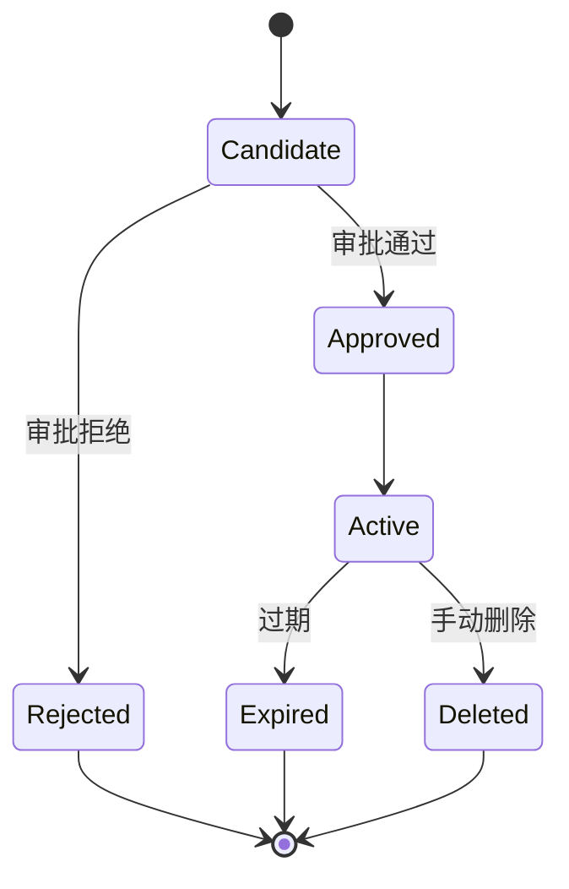

# memory-system Spec

## 1. Module Info

| 字段 | 值 |
| --- | --- |
| Module ID | `memory-system` |
| Module Name | Memory System |
| Status | Draft |
| Owner | 架构组（占位） |
| Dependencies | session-store, event-system |
| Dependents | runtime-core, context-manager |
| Related Requirements | FR-MEMORY-001..004 |
| Related ADRs | ADR-0006, ADR-0007 |
| MVP | No（V0.2） |

## 2. Purpose
memory-system 提供跨会话记忆：四类记忆的存储、检索与审批，使 Agent 能复用项目知识、用户偏好与历史经验，同时严格控制记忆污染与隐私。

## 3. Scope
- 四类记忆：User / Project / Episodic / Procedural。
- SQLite + FTS5 关键词检索（不引入向量库，ADR-0007）。
- 记忆元数据：来源、创建时间、最后验证、置信度、过期时间。
- 手动编辑/删除、候选记忆审批、项目隔离、敏感信息控制。
- 污染控制：不自动写入所有模型输出，仅经审批候选生效。

## 4. Non-goals
- 不引入向量数据库/Embedding（ADR-0007，除非证明 FTS5 不足）。
- 不拥有 Session/Event 存储（session-store，共用 DB 不同表）。
- 不做上下文组装（context-manager 消费 RetrievedMemory）。
- 不自动采信模型输出为记忆。

## 5. Responsibilities
- 拥有 Memory 实体与存储。
- 提供检索（关键词/FTS5）供 context-manager 的 RetrievedMemory 层。
- 候选记忆审批流（人工/规则）。
- 项目隔离与敏感信息脱敏/拒绝。
- 产生 MemoryRead/MemoryWrite 事件。

## 6. Public Interfaces

```go
type MemoryStore interface {
    Put(ctx context.Context, m Memory) error            // 仅 Approved 候选可入库
    Recall(ctx context.Context, q Query) ([]Memory, error)
    Edit(ctx context.Context, id string, patch MemoryPatch) error
    Delete(ctx context.Context, id string) error
}

type CandidateReview interface {
    Submit(ctx context.Context, c MemoryCandidate) (CandidateID, error)
    Approve(ctx context.Context, id CandidateID) (Memory, error)
    Reject(ctx context.Context, id CandidateID) error
}

type Memory struct {
    ID         string
    Class      MemoryClass // User|Project|Episodic|Procedural
    ProjectID  string      // 项目隔离
    Content    string
    Source     string
    CreatedAt, LastVerifiedAt time.Time
    Confidence float64
    ExpiresAt  *time.Time
}
```

## 7. Domain Model
- `Memory`、`MemoryClass`、`MemoryCandidate`、`MemoryPatch`、`Query`。
- 候选状态：`Candidate → Reviewed(Approved/Rejected)`。
- 本模块拥有 Memory（DATA_OWNERSHIP）。

## 8. State Machine
候选记忆生命周期：



## 9. Core Flows
- **检索**：context-manager 请求 Recall(Query, ProjectID) → FTS5 关键词检索 → 按置信度/时效过滤 → 返回 + MemoryRead 事件。
- **候选生成**：任务中产生候选（不直接入库）→ Submit → 待审批。
- **审批**：人工/规则 Approve → Put 入库 → Active；Reject 丢弃。
- **维护**：手动 Edit/Delete；过期自动失效；LastVerified 更新。

## 10. Configuration

| Key | 默认值 | 作用域 | 敏感 | 说明 |
| --- | --- | --- | --- | --- |
| `memory.auto_candidate` | true | 全局 | 否 | 是否自动产生候选（仍需审批） |
| `memory.require_approval` | true | 全局 | 否 | 候选入库需审批（FR-MEMORY-004） |
| `memory.default_confidence` | 0.5 | 全局 | 否 | 初始置信度 |
| `memory.default_ttl` | 90d | 全局 | 否 | 默认过期 |
| `memory.redact_sensitive` | true | 全局 | 是 | 敏感信息脱敏/拒绝 |

## 11. Persistence
拥有 Memory 表（SQLite + FTS5，与 session-store 同库不同表）。项目隔离通过 ProjectID 分区。Schema 版本化迁移。

## 12. Concurrency
- 检索可并发（FTS5 读）。
- 写入经审批，串行入库。
- 取消经 context 传播。
- 幂等：相同候选去重。

## 13. Error Model
`PersistenceError`（存储失败）、`ValidationError`（候选非法/含敏感信息被拒）、`PermissionDenied`（跨项目访问被拒）、`ConflictError`（重复候选）。

## 14. Security
- **污染控制**（RISK-010）：不自动采信模型输出；仅 Approved 候选 Active（FR-MEMORY-004）。
- 项目隔离：跨项目读写被拒。
- 敏感信息：密钥/PII 脱敏或拒绝入库。
- 来源追踪与置信度，便于审查与撤销受污染记忆。

## 15. Observability
- 事件：MemoryRead、MemoryWrite。
- 指标：检索命中率、候选提交/通过/拒绝数、过期清理数。

## 16. Testing Strategy
- Unit：FTS5 检索、置信度/时效过滤、项目隔离。
- Security：污染控制（未审批不生效）、敏感信息拒绝、跨项目隔离。
- Integration：与 context-manager RetrievedMemory、与 session-store DB。
- Migration：Schema 升级。

## 17. Acceptance Criteria
- [ ] 四类记忆可存储与检索。
- [ ] FTS5 关键词检索按置信度/时效过滤。
- [ ] 候选记忆未审批不进入 Active（FR-MEMORY-004）。
- [ ] 跨项目访问被拒（项目隔离）。
- [ ] 敏感信息脱敏或拒绝入库。
- [ ] 手动编辑/删除生效，过期自动失效。

## 18. Risks
RISK-010（记忆污染）。

## 19. Open Questions
- 是否需语义检索（Q10，仅当 FTS5 证明不足）。
- 候选审批的自动化门槛（低风险自动 vs 全人工）。
- Episodic/Procedural 记忆的提取与表示方式。
