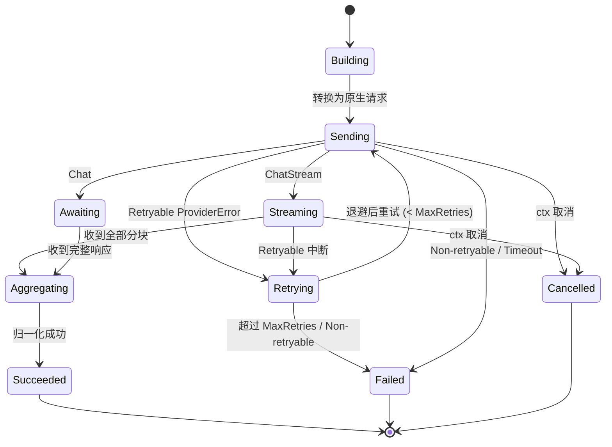
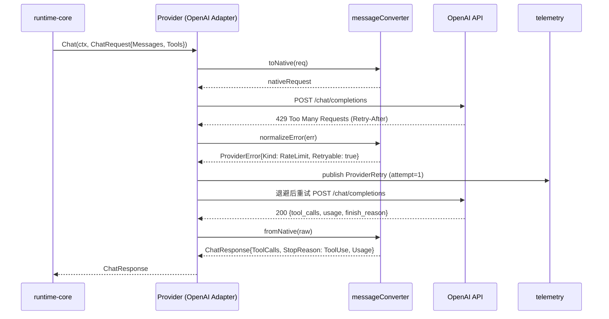

# Model Provider Spec

> 本文件为 `model-provider` 模块规格说明。标题为英文技术术语，正文使用简体中文。

## 1. Module Info

| 字段 | 值 |
| --- | --- |
| Module ID | `model-provider` |
| Module Name | Model Provider |
| Status | Draft |
| Owner | ForgeCode 核心架构组（占位） |
| Dependencies | `telemetry` |
| Dependents | `runtime-core`, `context-manager` |
| Related Requirements | FR-PROVIDER-001, FR-PROVIDER-002, FR-PROVIDER-003, FR-PROVIDER-004, FR-PROVIDER-005, FR-PROVIDER-006, NFR-REL-002, NFR-MAINT-001, NFR-LIMIT-001, NFR-TEST-001 |
| Related ADRs | ADR-0003 |
| MVP | Yes（先交付 Mock + OpenAI，Anthropic / OpenAI-Compatible 后置） |

## 2. Purpose

ForgeCode 必须 **Model-Agnostic**：Runtime 不得依赖任何单一 Provider 的请求/响应结构。本模块定义中立的 `Provider` 接口与中立的 ChatRequest / ChatResponse / StreamChunk / ToolCall / TokenUsage 数据结构，并在适配器内部完成各家私有协议的 **双向消息转换** 与 **错误归一化**。其目标是让 `runtime-core` 与 `context-manager` 仅依赖中立接口即可替换底层模型（ADR-0003）。

## 3. Scope

- 定义中立 `Provider` 接口（普通响应 + Streaming）。
- 定义中立请求/响应/流式分块/工具调用/停止原因/Token 用量数据结构。
- 实现 provider-specific 消息转换层（中立结构 ↔ 各家私有结构），私有结构不泄漏到 runtime-core。
- 将各家原生错误归一化为 `ProviderError`（含 `RateLimit` 子类），并标注可重试性。
- 实现重试 + 退避 + 超时编排（瞬时错误重试，不可重试快速失败）。
- 暴露 Model Capability 与 Context Window 元数据；支持 Structured Output 请求与解析。
- 提供 Mock / OpenAI / Anthropic / OpenAI-Compatible 四个适配器（MVP 仅 Mock + OpenAI）。
- 提供 **Contract Test** 套件，对全部适配器执行同一行为契约。

## 4. Non-goals

- 不实现 Agent Loop、状态机、循环检测（属 `runtime-core`）。
- 不做上下文分层、Token 预算计算、Compaction（属 `context-manager`，本模块只暴露 usage 与窗口元数据）。
- 不做工具的执行、权限决策与审计（属 `tool-runtime` / `permission-engine`）。
- 不持久化任何请求/响应/事件（无数据所有权）。
- 不统一各 Provider 的私有专有能力，只统一公共能力子集（RISK-004）。
- 不实现 Prompt 模板渲染与消息编排策略。

## 5. Responsibilities

- 提供单一中立 `Provider` 接口，屏蔽 OpenAI / Anthropic 等协议差异。
- 将中立 `ChatRequest` 转换为目标 Provider 的原生请求，并将原生响应（含多 Tool Call、Stop Reason、Token Usage）转换回中立结构。
- 处理 Streaming：将原生 SSE/分块流转换为统一 `StreamChunk` 序列，并在流结束时汇总完整响应与 usage。
- 将网络/协议/限流错误归一化为 `ProviderError`（含 `RateLimit`），标注 retryable / non-retryable。
- 执行 per-call 超时与可配置的指数退避重试（NFR-REL-002），并就每次重试发布事件。
- 暴露 `ModelCapability`（是否支持 tools / streaming / structured output / vision）与 `ContextWindow`（最大输入/输出 token）。
- 支持 Structured Output：将期望 JSON Schema 下发并解析模型结构化结果。
- 对外只暴露中立类型，私有 SDK 类型限制在适配器包内部（NFR-MAINT-001）。

## 6. Public Interfaces

使用 Go 风格伪代码，本阶段不要求可编译。

```go
package modelprovider

// Provider 是 runtime-core 与 context-manager 唯一可见的中立接口。
type Provider interface {
    // Chat 执行一次非流式补全，返回完整中立响应。
    Chat(ctx context.Context, req ChatRequest) (ChatResponse, error)
    // ChatStream 执行流式补全；StreamReader 产出 StreamChunk，结束后可取汇总响应。
    ChatStream(ctx context.Context, req ChatRequest) (StreamReader, error)
    // Capability 返回模型能力与上下文窗口元数据（FR-PROVIDER-005）。
    Capability(model string) (ModelCapability, error)
    // Name 返回适配器标识，如 "openai" / "anthropic" / "openai-compat" / "mock"。
    Name() string
}

// StreamReader 增量读取流式分块。
type StreamReader interface {
    Recv() (StreamChunk, error) // 返回 io.EOF 表示流正常结束
    Response() (ChatResponse, error) // 流结束后获取汇总响应（含 usage / stop reason）
    Close() error
}

// ChatRequest 为中立请求结构（不含任何 Provider 私有字段）。
type ChatRequest struct {
    Model         string
    Messages      []Message       // 中立消息（system/user/assistant/tool）
    Tools         []ToolSchema    // 中立工具 schema（来自 tool-runtime 的 Descriptor 投影）
    ToolChoice    ToolChoice      // Auto / None / Required / Named
    Temperature   *float64
    MaxTokens     *int            // Reserved Output
    StructuredOut *StructuredSpec // 期望结构化输出（FR-PROVIDER-005）
    Stop          []string
}

// ChatResponse 为中立响应结构。
type ChatResponse struct {
    Message    Message      // assistant 消息（可含文本与多个 ToolCall）
    ToolCalls  []ToolCall   // 解析出的工具调用（FR-PROVIDER-002）
    StopReason StopReason   // EndTurn / ToolUse / MaxTokens / StopSequence / ContentFilter
    Usage      TokenUsage   // InputTokens / OutputTokens / TotalTokens
    Model      string
}

// StreamChunk 为统一流式分块。
type StreamChunk struct {
    Kind         ChunkKind  // TextDelta / ToolCallDelta / StopReason / UsageUpdate
    TextDelta    string
    ToolCallР    *ToolCallDelta
    StopReason   StopReason
    Usage        *TokenUsage
}

// ToolCall 为中立工具调用（结构契约由 tool-runtime 拥有，本模块只生产）。
type ToolCall struct {
    ID        string
    Name      string
    Arguments json.RawMessage // 已校验 JSON，未做权限判断
}

type TokenUsage struct {
    InputTokens  int
    OutputTokens int
    TotalTokens  int
}

type ModelCapability struct {
    SupportsTools          bool
    SupportsStreaming      bool
    SupportsStructuredOut  bool
    SupportsVision         bool
    ContextWindow          ContextWindow
}

type ContextWindow struct {
    MaxInputTokens  int
    MaxOutputTokens int
}

// ProviderError 为归一化错误（见 §13）。
type ProviderError struct {
    Category   ErrorCategory // ProviderError（含 RateLimit 子类）/ TimeoutError / ValidationError
    Kind       ProviderErrKind // RateLimit / Auth / BadRequest / ServerError / Network / Overloaded
    Retryable  bool
    RetryAfter time.Duration // RateLimit 场景的建议退避
    Cause      error
}

// MessageConverter 由各适配器实现，完成中立↔私有双向转换（不导出私有类型）。
type messageConverter interface {
    toNative(req ChatRequest) (any, error)
    fromNative(raw any) (ChatResponse, error)
    normalizeError(err error) ProviderError
}
```

## 7. Domain Model

| 实体/值对象 | 类型 | 拥有模块 | 说明 |
| --- | --- | --- | --- |
| `Provider` | 接口 | `model-provider` | 中立 Provider 抽象 |
| `ChatRequest` / `ChatResponse` | 值对象 | `model-provider` | 中立请求/响应 |
| `StreamChunk` / `StreamReader` | 值对象/接口 | `model-provider` | 统一流式分块 |
| `ToolCall` | 值对象（契约属 `tool-runtime`） | `tool-runtime` | 本模块只生产，不定义其权威契约 |
| `TokenUsage` | 值对象 | `model-provider` | Token 用量，供 `context-manager` 读取 |
| `ModelCapability` / `ContextWindow` | 值对象 | `model-provider` | 能力与窗口元数据 |
| `StopReason` | 枚举 | `model-provider` | EndTurn / ToolUse / MaxTokens / StopSequence / ContentFilter |
| `ProviderError` | 错误值对象 | `model-provider` | 归一化错误 |

枚举：

```text
StopReason:      EndTurn | ToolUse | MaxTokens | StopSequence | ContentFilter
ToolChoice:      Auto | None | Required | Named
ChunkKind:       TextDelta | ToolCallDelta | StopReason | UsageUpdate
ProviderErrKind: RateLimit | Auth | BadRequest | ServerError | Network | Overloaded
```

> 本模块 **无持久化数据所有权**（见 `DATA_OWNERSHIP.md`）。`ToolCall` 契约归 `tool-runtime`，本模块仅作为生产者。

## 8. State Machine

单次 Provider 调用的生命周期（含重试）：



## 9. Core Flows

带工具调用与一次限流重试的非流式调用：



异常流程：超时（`TimeoutError`，可重试视配置）、不可重试错误（`Auth`/`BadRequest` 直接 `Failed`）、`ctx` 取消（`CancelledError`，立即终止不再重试）、流中断（已产出分块后中断按 retryable 判定，重试从头重建请求且不向调用方泄漏半截分块）。

## 10. Configuration

| Key | 默认值 | 作用域 | 敏感 | 说明 |
| --- | --- | --- | --- | --- |
| `provider.default` | `openai` | 全局 | 否 | 默认适配器 |
| `provider.api_key` | （无） | 适配器 | 是 | 凭证，仅注入适配器，禁止落普通日志 |
| `provider.base_url` | 各家默认 | 适配器 | 否 | OpenAI-Compatible 自定义端点 |
| `provider.timeout` | `60s` | 调用 | 否 | 单次调用超时 |
| `provider.max_retries` | `3` | 调用 | 否 | 瞬时错误最大重试次数（NFR-REL-002） |
| `provider.backoff_base` | `500ms` | 调用 | 否 | 指数退避基值 |
| `provider.backoff_max` | `8s` | 调用 | 否 | 退避上限 |
| `provider.stream` | `true` | 调用 | 否 | 是否优先使用流式 |

## 11. Persistence

本模块 **不持久化**任何数据，无数据所有权（见 `DATA_OWNERSHIP.md`）。Token Usage 由 `context-manager` 读取、`telemetry` 记账（`UsageRecord` 归 telemetry）。无迁移策略。

## 12. Concurrency

- `Provider` 实现须 **goroutine 安全**：同一实例可被多个 Agent / SubAgent 并发调用，内部不共享可变状态（HTTP client 复用且无状态）。
- 每次调用绑定独立 `context.Context`；`ctx` 取消须立即中止请求与重试循环，并关闭底层连接（`CancelledError`）。
- `StreamReader` 非并发安全：单一消费者顺序 `Recv`，`Close` 幂等。
- 重试退避使用注入式 `Clock`，便于测试（NFR-TEST-001），无全局状态。
- 顺序与幂等：本模块不保证请求幂等（由 runtime-core 决定是否重发）；流式分块对单一消费者严格有序。
- `go test -race` 须无数据竞争（NFR-TEST-001）。

## 13. Error Model

引用 `GLOSSARY.md` 标准错误分类：

| 错误类别 | 触发条件 | Retryable | 调用方处理 |
| --- | --- | --- | --- |
| `ValidationError` | 请求缺字段 / Schema 非法 / 模型不支持所请求能力 | 否 | 修正请求；不重发 |
| `ProviderError`（`RateLimit` 子类） | 429 / 配额；其余 Auth/BadRequest/ServerError/Network/Overloaded | RateLimit/ServerError/Network/Overloaded=是，Auth/BadRequest=否 | 按 `Retryable` 决定重试；`RetryAfter` 优先 |
| `TimeoutError` | 单次调用超 `provider.timeout` | 视配置 | 可重试或上抛 |
| `CancelledError` | `ctx` 取消 / 用户取消 | 否 | 立即终止，落 Cancelled |

每类错误均标注是否可重试、是否需审计（Provider 错误本身非审计事件，但重试通过 `ProviderRetry` 事件可观测）。

## 14. Security

- **信任边界**：`Runtime ↔ Model Provider` 响应 **不可信**（可能含 Prompt Injection / 恶意 Tool Call）。本模块只做 **结构校验与解析**，不执行任何 Tool Call，不做权限判断——权限交由 `permission-engine`，执行交由 `tool-runtime`。
- **攻击面**：恶意/被劫持响应注入伪造 Tool Call 或超大输出。缓解：Tool Call 参数须为合法 JSON 且通过 schema 浅校验；输出大小遵守 `NFR-LIMIT-001`（截断由 context-manager/tool-runtime 负责，本模块不放大）。
- **敏感数据**：`api_key` 仅注入适配器，禁止进入 `ChatRequest`/事件/普通日志；请求体脱敏由 `telemetry` 强制（FR-TELEMETRY-001 / NFR-SEC-002）。
- **Provider 私有结构隔离**：私有 SDK 类型不得出现在导出 API 中（ADR-0003），集中校验便于注入防护。

## 15. Observability

- **Log**：调用开始/结束、适配器名、model、延迟、重试次数（脱敏后，无密钥/无完整 prompt）。
- **Metric**：调用次数、错误率（按 `ProviderErrKind`）、重试次数、P50/P95 延迟、流首字节时延。
- **Trace**：可选 per-call span（FR-TELEMETRY-002）。
- **Event**：`ProviderRetry`（每次重试）、`ModelCallFailed`（最终失败，供 Hook/审计）。注意 `PreModelCall`/`PostModelCall` 由 `runtime-core` 在调用边界发布；本模块只发布 `ProviderRetry` 与 `ModelCallFailed`。
- **Usage**：返回 `TokenUsage`，由 `telemetry` 写 `UsageRecord`（FR-TELEMETRY-004）。

## 16. Testing Strategy

- **Contract Test（核心）**：单一契约套件对 Mock / OpenAI / Anthropic / OpenAI-Compatible 全部适配器运行，断言相同输入→相同中立行为（多 Tool Call 解析、Stop Reason 映射、Usage 解析、Streaming 汇总一致）。落地 RISK-004 缓解。
- **Unit**：消息转换（中立↔私有双向）、能力元数据、StructuredOutput 解析、退避计算。
- **Failure Injection**：429 / 5xx / 网络中断 / 超时 / 流中途断开 → 验证归一化与重试/快速失败（FR-PROVIDER-004）。
- **Golden**：固定原生响应样本 → 固定中立响应输出，防回归。
- **Race**：并发 `Chat`/`ChatStream` 共用实例 `-race`。
- **Mock**：MockProvider 支持脚本化响应/错误/分块序列，供上游模块测试。

## 17. Acceptance Criteria

- [ ] `Provider` 接口同时支持 `Chat` 与 `ChatStream`，Mock + OpenAI 适配器通过同一 Contract Test（FR-PROVIDER-001/003）。
- [ ] 能正确解析多 Tool Call、Stop Reason、Token Usage（FR-PROVIDER-002）。
- [ ] 429/5xx/网络/超时归一化为 `ProviderError`（含 RateLimit）并正确标注 retryable，重试遵守 `max_retries` 与退避（FR-PROVIDER-004 / NFR-REL-002）。
- [ ] 暴露 `ModelCapability` 与 `ContextWindow`，支持 Structured Output 请求与解析（FR-PROVIDER-005）。
- [ ] 导出 API 不含任何 Provider 私有类型；`go vet`/依赖检查确认无私有结构泄漏到 runtime-core（FR-PROVIDER-006 / ADR-0003 / NFR-MAINT-001）。
- [ ] `ctx` 取消立即终止调用与重试并返回 `CancelledError`；`go test -race` 通过（NFR-TEST-001）。

## 18. Risks

- **RISK-004**：Provider 间能力差异导致行为不一致。缓解：统一接口 + 能力元数据 + Contract Test，仅统一公共子集。

## 19. Open Questions

- Q-PROV-1：流式中断已产出部分分块后的重试，是否需向调用方暴露"已重置"信号，还是完全透明重建？（默认透明，待 runtime-core 集成验证）
- Q-PROV-2：Structured Output 在不支持原生 JSON Schema 的 Provider 上，回退到"提示+解析校验"的可靠性边界。
- Q-PROV-3：能力元数据来源（静态表 vs 运行时探测）与版本更新策略，待 V0.2 评估。
