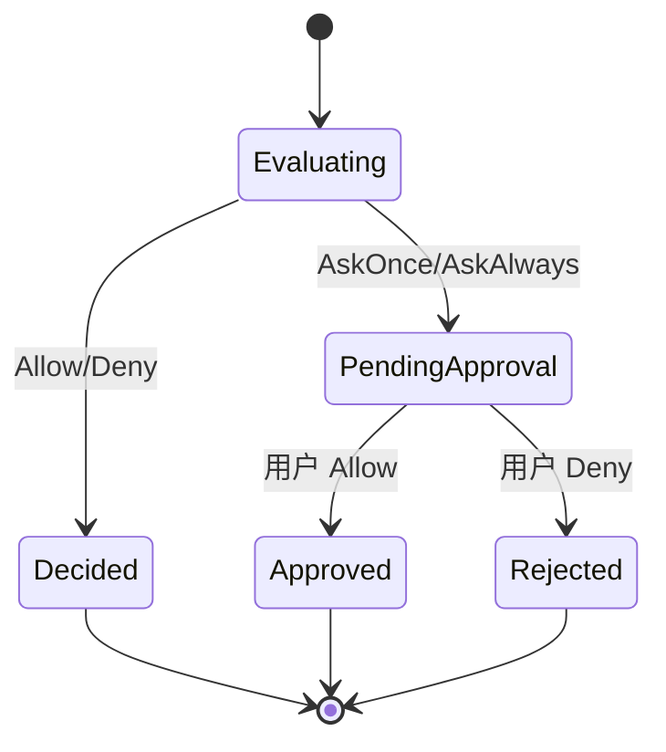

# permission-engine Spec

## 1. Module Info

| 字段 | 值 |
| --- | --- |
| Module ID | `permission-engine` |
| Module Name | Permission Engine |
| Status | Draft |
| Owner | 架构组（占位） |
| Dependencies | event-system, telemetry |
| Dependents | tool-runtime, mcp-client, extension-system, sandbox |
| Related Requirements | FR-PERM-001..008 |
| Related ADRs | ADR-0005, ADR-0012 |
| MVP | Yes（L1–L3 + L5；L4 仅挂钩接口） |

## 2. Purpose
permission-engine 是独立、纯决策的五层纵深权限防御组件。它接收 `(ToolDescriptor, 参数, 上下文)`，返回 `Decision` 与命中原因，**自身不执行任何操作**。它是 ForgeCode 安全模型的决策中枢。

## 3. Scope
- L1 Schema/输入校验。
- L2 资源边界（Workspace Root、读写/敏感/密钥目录、路径穿越、符号链接逃逸、隐藏文件、环境变量）。
- L3 操作风险策略（RiskLevel、Decision、Bash 结构化分析）。
- L4 沙箱委托挂钩（接口，实现在 sandbox）。
- L5 人工审批请求与审计记录（决策产出，存储交 session-store）。
- 决策优先级与冲突合并规则。

## 4. Non-goals
- 不执行命令或工具（ADR-0005）。
- 不实现沙箱（sandbox）。
- 不持久化 Approval（session-store）。
- 不实现审批 UI（cli）。
- 不实现 Hook（extension-system，但接收 Hook 决策参与合并）。

## 5. Responsibilities
- 拥有 RiskLevel/Decision 枚举与 Approval 契约。
- 顺序执行五层，任一层 Deny 即短路。
- 提供 Bash 结构化分析器（非整串匹配）。
- 合并多来源决策（默认策略 / Skill 声明 / Hook 返回 / 用户配置），最严格生效。
- 产生 ApprovalRequested 事件并返回命中原因供审计。

## 6. Public Interfaces

```go
type Decider interface {
    Decide(ctx context.Context, req DecisionRequest) (Decision, error)
}

type DecisionRequest struct {
    Descriptor toolruntime.ToolDescriptor
    Input      json.RawMessage
    Inv        InvocationContext // Session/Agent/来源/Workspace Root
    Overrides  []PolicySource    // Skill/Hook/用户配置（只能收窄）
}

type Decision struct {
    Effect   Effect      // Allow | AskOnce | AskAlways | Deny
    Risk     RiskLevel   // Low|Medium|High|Critical
    Reasons  []RuleHit   // 命中规则与原因（审计用）
    Layer    Layer       // 触发层 L1..L5
}

type BashAnalysis struct {
    Programs       []string
    Pipes, Redirects, Subshells, CmdSubst bool
    NetworkAccess, FileDeletion, ForcePush bool
    Docker, Kubernetes, DBWrite           bool
    DownloadThenExec, PrivilegeEscalation bool
}

type BashAnalyzer interface {
    Analyze(cmd string) (BashAnalysis, error)
}
```

## 7. Domain Model
- `Decision`、`Effect`（Allow/AskOnce/AskAlways/Deny）、`RiskLevel`、`RuleHit`、`Layer`、`PolicySource`、`BashAnalysis`。
- `Approval` 契约（决策记录字段，存储归 session-store）。
- 枚举权威定义见 GLOSSARY。

## 8. State Machine
决策为无状态纯函数；审批引入短生命周期：



## 9. Core Flows
- **只读 Allow**：L1 校验 → L2 路径在可读范围 → L3 Low → Allow。
- **写 AskOnce**：L1 → L2 可写范围 → L3 Medium → AskOnce → ApprovalRequested。
- **危险 Bash**：L1 → BashAnalyzer 识别 force-push/rm-rf → L3 High/Critical → AskAlways/Deny。
- **越界拒绝**：L2 检测路径穿越/符号链接逃逸 → Deny（短路）。
- **冲突合并**：多 PolicySource → 取最严格（Deny>AskAlways>AskOnce>Allow）。

## 10. Configuration

| Key | 默认值 | 作用域 | 敏感 | 说明 |
| --- | --- | --- | --- | --- |
| `perm.workspace_root` | 当前仓库 | Session | 否 | 操作根边界 |
| `perm.writable_paths` | workspace 内 | Session | 否 | 可写目录白名单 |
| `perm.sensitive_paths` | `.env,.git,~/.ssh,...` | 全局 | 是 | 敏感/密钥目录 |
| `perm.default_bash` | AskOnce | 全局 | 否 | Bash 默认决策 |
| `perm.network_default` | Deny | 全局 | 否 | 默认网络访问策略 |

## 11. Persistence
本模块无状态；Approval 记录与命中原因经事件交 session-store/telemetry。策略配置由 cli/配置加载注入。

## 12. Concurrency
- 纯决策，线程安全、可并发。
- BashAnalyzer 无共享可变状态。
- 无顺序依赖；同一请求决策幂等。

## 13. Error Model
`ValidationError`（L1）、`PermissionDenied`（L2/L3/L5 Deny）、`ApprovalRequired`（AskOnce/AskAlways，非终态）。决策本身不返回执行错误。

## 14. Security
- 决策与执行分离（ADR-0005），消除"Permission Engine 直接执行命令"。
- L2 规范化路径并解析符号链接真实路径后判断（RISK-007）。
- L3 Bash 结构化分析防整串绕过（RISK-006）。
- Skill/Hook 只能收窄不能扩权；最严格生效（RISK-008）。
- 命中原因与原始参数（脱敏）入审计。

## 15. Observability
- 事件：ApprovalRequested、ApprovalResolved、AuditRecorded。
- 指标：各风险等级决策计数、审批通过/拒绝率、Deny 命中规则分布。

## 16. Testing Strategy
- Unit：各层规则、决策合并优先级。
- Security：路径穿越、符号链接逃逸、命令注入、密钥目录、提权命令语料库。
- Golden：Bash 分析输入→分析结果。
- Contract：与 tool-runtime 决策接口。
- Failure Injection：异常路径/畸形输入。

## 17. Acceptance Criteria
- [ ] 任一层 Deny 短路且记录触发层与原因。
- [ ] Bash 分析正确识别 force-push、rm -rf、下载后执行、提权等（语料库通过）。
- [ ] 路径穿越与符号链接逃逸被 L2 拦截。
- [ ] 多来源冲突取最严格；Skill/Hook 无法扩权。
- [ ] 引擎不执行任何外部操作（代码审查 + 测试证明）。

## 18. Risks
RISK-006（Bash 误判）、RISK-007（路径逃逸）、RISK-008（审批绕过）。

## 19. Open Questions
- Bash 分析采用自研 lexer 还是借用 shell 解析库（影响子 Shell/命令替换识别精度）。
- 敏感目录默认清单的可移植性（跨平台路径）。
- AskOnce 的"once"作用域（单 Session/单文件/单命令模式）需 M2 明确。
