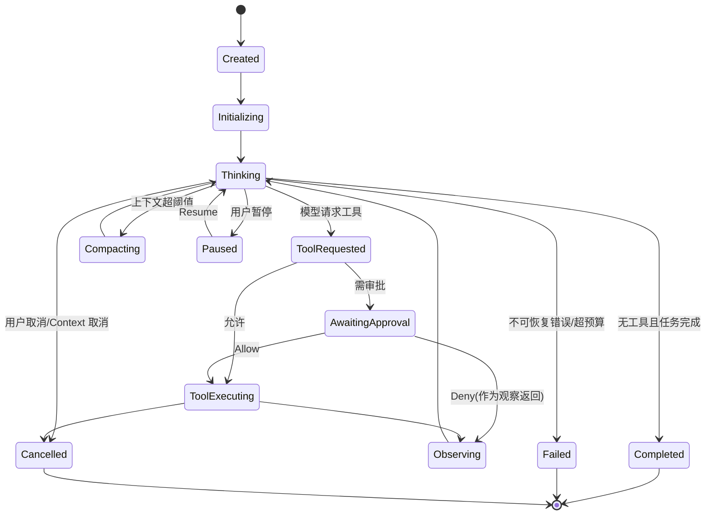

# runtime-core Spec

## 1. Module Info

| 字段 | 值 |
| --- | --- |
| Module ID | `runtime-core` |
| Module Name | Runtime Core |
| Status | Draft |
| Owner | 架构组（占位） |
| Dependencies | model-provider, tool-runtime, context-manager, event-system, session-store, permission-engine, telemetry |
| Dependents | cli, agent-orchestration, evaluation |
| Related Requirements | FR-RUNTIME-001..006, FR-SESSION-003 |
| Related ADRs | ADR-0001, ADR-0002, ADR-0003 |
| MVP | Yes |

## 2. Purpose
runtime-core 是 ForgeCode 的控制平面核心。它以显式状态机驱动 Agent Loop，编排"模型调用→工具调用→观察→继续/终止"的循环，并提供取消、预算、循环检测与基于事件的恢复。它是项目"自主实现 Agent Runtime"的核心证据所在。

## 3. Scope
- Agent 状态机与状态转移。
- Agent Loop：解析模型输出、识别 Tool Call、驱动工具执行、读取 Observation、判断继续。
- Runtime Coordinator：装配 Provider/Tool/Context/Store 等接口并管理单次 Session 的运行。
- 预算与上限：最大轮次、最大工具调用、Token/Cost 预算、Deadline。
- 取消传播、用户暂停/取消。
- 循环检测（重复工具调用、相同错误循环）、非法 Tool Call 处理。
- 通过事件重放恢复运行态。

## 4. Non-goals
- 不实现具体 Provider（model-provider）、具体工具（builtin-tools）、权限决策（permission-engine）。
- 不直接持久化（经 session-store）。
- 不做上下文压缩算法本身（context-manager），仅触发其 Compacting 状态。
- 不编排多 Agent（agent-orchestration 复用本模块启动子 Agent）。

## 5. Responsibilities
- 拥有 `AgentInstance` 运行态与 Agent 状态机。
- 在每个关键转移产生事件（经 event-system）。
- 强制每次工具调用走 tool-runtime 统一管线（不绕过权限）。
- 在预算/上限/Deadline 触发时安全终止并落事件。
- 协调 Checkpoint 与 Compaction 时机。
- 提供 Resume(sessionID)：从事件流重建状态。

## 6. Public Interfaces

```go
type Runtime interface {
    StartSession(ctx context.Context, req StartRequest) (*Session, error)
    Submit(ctx context.Context, sessionID string, prompt UserPrompt) error
    Pause(ctx context.Context, sessionID string) error
    Cancel(ctx context.Context, sessionID string) error
    Resume(ctx context.Context, sessionID string) (*Session, error)
}

// AgentLoop 单步推进；由 Coordinator 循环调用。
type AgentLoop interface {
    Step(ctx context.Context, st *AgentState) (StepResult, error)
}

type Coordinator struct {
    Provider  modelprovider.Provider   // 接口，注入
    Tools     toolruntime.Invoker      // 统一管线入口
    Context   contextmanager.Builder
    Store     sessionstore.Store
    Bus       eventsystem.Bus
    Budget    BudgetController
}

type StepResult struct {
    NextState AgentStateName
    Events    []eventsystem.Event
    Done      bool
}
```

## 7. Domain Model
- `AgentInstance`：运行中的 Agent（ID、状态、预算计数、当前计划）。本模块拥有运行态。
- `AgentState`：状态名 + 计数器（turns、toolCalls、tokens、cost） + 最近工具调用指纹（循环检测）。
- `BudgetController`：维护 Token/Cost/turns/toolCalls/Deadline 上限与当前消耗。
- `LoopDetector`：基于工具调用指纹与错误指纹的窗口检测。
- 枚举：Agent State（见 GLOSSARY，权威）。

## 8. State Machine



## 9. Core Flows
- **正常**：Submit → Initializing → Thinking →（PreModelCall）模型 →（PostModelCall）→ ToolRequested → Permission → ToolExecuting → PostToolUse → Observing → Thinking → … → Completed。
- **审批**：ToolRequested → permission-engine 返回 ApprovalRequired → AwaitingApproval → 等待 cli/Hook 决策 → Allow/Deny。
- **压缩**：Thinking 检测 token 超阈值 → PreCompact Checkpoint → Compacting（调用 context-manager）→ PostCompact → Thinking。
- **异常**：模型错误（重试或 Failed）、非法 Tool Call（作为 Observation 反馈让模型纠正）、循环检测命中（强制 Failed + LoopDetected 事件）。
- **恢复**：Resume → session-store 读事件 → 重放重建 AgentState → 回到末态对应行为（不重放外部副作用）。

## 10. Configuration

| Key | 默认值 | 作用域 | 敏感 | 说明 |
| --- | --- | --- | --- | --- |
| `runtime.max_turns` | 50 | Session | 否 | 最大循环轮次 |
| `runtime.max_tool_calls` | 200 | Session | 否 | 最大工具调用数 |
| `runtime.token_budget` | 模型窗口×4 | Session | 否 | Token 预算 |
| `runtime.cost_budget_usd` | 5.0 | Session | 否 | 成本预算 |
| `runtime.deadline` | 30m | Session | 否 | 运行时限 |
| `runtime.loop_window` | 6 | Session | 否 | 循环检测窗口大小 |
| `runtime.provider_retries` | 3 | Session | 否 | Provider 重试次数 |

## 11. Persistence
本模块不直接持久化；运行态以事件形式经 session-store 落盘。AgentState 可由事件重建。Checkpoint 由 session-store 拥有，本模块决定创建时机。

## 12. Concurrency
- 单 Session 的 Loop 串行推进（状态机单线程演进），避免状态竞态。
- 多 Session 可并发，各自独立 Coordinator。
- 取消通过 `context.Context` 传播到 Provider 调用与工具执行。
- 事件发布对单订阅者有序。
- 幂等：恢复重放不产生外部副作用。

## 13. Error Model
使用 GLOSSARY 分类：`ProviderError`（重试/Failed）、`ToolExecutionError`（作为 Observation）、`ApprovalRequired`（转 AwaitingApproval，非终态）、`CancelledError`（转 Cancelled）、`TimeoutError`（Deadline→Failed）、`RecoveryError`（重放失败→报告并停在安全态）、`PersistenceError`（暂停 Session 并告警）。

## 14. Security
- 强制所有工具调用经 tool-runtime + permission-engine，禁止旁路（NFR-SEC-001）。
- 模型输出为不可信输入，非法/异常 Tool Call 不直接执行，作为 Observation 反馈。
- 高风险操作未经审批不自动执行；审批后执行前崩溃恢复时重判（FAILURE_AND_RECOVERY）。
- 不在普通日志输出完整提示/密钥（交 telemetry 脱敏）。

## 15. Observability
- 事件：AgentStateChanged、PreModelCall/PostModelCall、ToolRequested/Observed、BudgetExceeded、LoopDetected、SessionPaused/Resumed。
- 指标：每 Session 轮次、工具调用、Token、Cost、错误率（telemetry）。
- Trace：一次 Submit 的端到端跨度（可选）。

## 16. Testing Strategy
- Unit：状态转移、预算计数、循环检测。
- Golden：固定 Mock 响应序列 → 期望状态轨迹。
- Integration：与 tool-runtime/permission-engine/session-store 跑通只读与修改流程。
- Failure Injection：Provider 错误、工具超时、压缩失败、进程崩溃。
- Recovery：杀进程后 Resume 状态一致（NFR-REL-001）。
- Race：`go test -race` 多 Session 并发。

## 17. Acceptance Criteria
- [ ] 状态机按 §8 合法转移，非法转移被拒并记录。
- [ ] 任一上限（turns/tool/token/cost/deadline）触发时安全终止并落 BudgetExceeded。
- [ ] 重复工具调用与相同错误循环被检测并终止。
- [ ] 用户取消传播到正在执行的工具。
- [ ] 杀进程后 Resume 恢复到末态且不重放外部副作用。
- [ ] 所有工具调用均经统一管线（代码与测试证明无旁路）。

## 18. Risks
RISK-001（范围）、RISK-003（Loop 不稳定）、RISK-020（接口漂移）。

## 19. Open Questions
- Q1（Go 版本）影响 context/泛型用法。
- 压缩触发阈值与窗口预留的默认比例需 M3 调参。
- 多 Session 并发上限策略（与 session-store SQLite 写限制 RISK-017 相关）。
