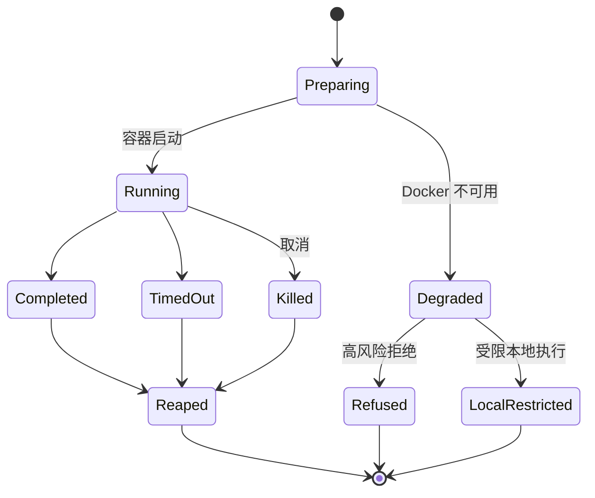

# sandbox Spec

## 1. Module Info

| 字段 | 值 |
| --- | --- |
| Module ID | `sandbox` |
| Module Name | Sandbox |
| Status | Draft |
| Owner | 架构组（占位） |
| Dependencies | permission-engine, telemetry |
| Dependents | tool-runtime（Bash 执行） |
| Related Requirements | FR-SANDBOX-001..003, FR-PERM-006 |
| Related ADRs | ADR-0012 |
| MVP | No（V0.2） |

## 2. Purpose
sandbox 提供基于 Docker 的运行时隔离执行环境，是五层纵深防御的 L4。它在受控容器中执行高风险命令，限制资源与网络，并在 Docker 不可用时安全降级。不自研容器运行时。

## 3. Scope
- Docker 沙箱执行：工作目录挂载、只读挂载、网络控制。
- 资源限制：CPU/内存/PID/执行时间，环境变量过滤，临时目录，进程回收。
- 降级策略：Docker 不可用时拒绝高风险或回退本地受限执行。

## 4. Non-goals
- 不实现容器运行时（封装 Docker SDK/CLI）。
- 不做权限决策（permission-engine 决定是否进沙箱）。
- 不实现工具逻辑（builtin-tools）。
- 第一版不实现 gVisor/Firecracker 等更强隔离。

## 5. Responsibilities
- 提供 `Sandbox` 接口：在隔离环境执行命令并返回结果。
- 实施挂载、网络、资源限制与环境变量过滤。
- 进程回收与超时终止。
- 检测 Docker 可用性并按策略降级。
- 产生沙箱执行审计。

## 6. Public Interfaces

```go
type Sandbox interface {
    Available() bool
    Exec(ctx context.Context, spec ExecSpec) (ExecResult, error)
}

type ExecSpec struct {
    Command    []string
    WorkdirMount   Mount       // 读写工作区
    ReadOnlyMounts []Mount
    Network    NetworkPolicy   // None|Restricted|Full
    Limits     ResourceLimits  // CPU/Mem/PID/Timeout
    EnvAllow   []string        // 仅放行白名单环境变量
}

type ResourceLimits struct {
    CPUMillicores int
    MemoryMB      int
    PIDs          int
    Timeout       time.Duration
}

type ExecResult struct {
    ExitCode int
    Stdout, Stderr string
    Truncated bool
    TimedOut  bool
}
```

## 7. Domain Model
- `ExecSpec`、`ExecResult`、`Mount`、`NetworkPolicy`、`ResourceLimits`。
- 无持久实体；执行态在内存。

## 8. State Machine
单次执行（非持久）：



## 9. Core Flows
- **沙箱执行**：permission-engine 决定高风险命令进沙箱 → tool-runtime 调 Sandbox.Exec → 准备容器（挂载/网络/限制/env 过滤）→ 执行（超时）→ 回收 → 返回结果。
- **降级**：Available()=false → 按策略 Refused（拒绝高风险）或 LocalRestricted（受限本地），并审计告警（FR-SANDBOX-003）。
- **取消**：context 取消 → Kill 容器 → 回收。

## 10. Configuration

| Key | 默认值 | 作用域 | 敏感 | 说明 |
| --- | --- | --- | --- | --- |
| `sandbox.enabled` | false（MVP）/true（V0.2） | 全局 | 否 | 是否启用 |
| `sandbox.image` | 轻量基础镜像 | 全局 | 否 | 执行镜像 |
| `sandbox.network` | None | 全局 | 否 | 默认网络策略 |
| `sandbox.cpu_millicores` | 1000 | 全局 | 否 | CPU 限制 |
| `sandbox.memory_mb` | 512 | 全局 | 否 | 内存限制 |
| `sandbox.timeout` | 60s | 全局 | 否 | 执行超时 |
| `sandbox.degrade_policy` | Refuse | 全局 | 否 | 降级策略（Refuse/LocalRestricted） |

## 11. Persistence
不持久化；审计经事件落 telemetry/session-store。

## 12. Concurrency
- 多次执行并发，各自独立容器。
- 取消经 context → 容器 Kill。
- 进程回收保证无孤儿容器。
- 幂等：执行无状态（命令本身可能有副作用，但沙箱隔离）。

## 13. Error Model
`SandboxError`（容器准备/执行失败）、`TimeoutError`（超时）、`CancelledError`（取消）、`PermissionDenied`（降级拒绝高风险）。

## 14. Security
- 隔离层：工作目录读写 + 其他只读 + 网络默认 None + 资源限制。
- 环境变量白名单过滤，防密钥泄露到容器（SECURITY_MODEL）。
- Sandbox Escape 假设下仍受 L1–L3 约束（纵深防御）。
- 不在普通日志输出容器内敏感输出。

## 15. Observability
- 事件：沙箱执行审计（命令、限制、结果、是否降级）。
- 指标：执行次数、超时/被杀、降级次数、资源使用。

## 16. Testing Strategy
- Integration：真实 Docker 执行（CI 有 Docker 时）。
- Unit：ExecSpec 构造、env 过滤、降级决策。
- Failure Injection：Docker 不可用、容器启动失败、超时、取消、回收失败。
- Security：网络隔离、挂载越界、env 泄露验证。

## 17. Acceptance Criteria
- [ ] 高风险命令在容器中执行，挂载/网络/资源限制生效。
- [ ] 环境变量按白名单过滤。
- [ ] 超时/取消终止并回收容器，无孤儿。
- [ ] Docker 不可用时按 degrade_policy 安全降级并审计。
- [ ] 沙箱执行产生审计事件。

## 18. Risks
Sandbox Escape（纵深防御缓解）、NFR-PORT-001（Docker 依赖，降级处理）。

## 19. Open Questions
- 默认基础镜像选型与体积。
- LocalRestricted 降级的具体约束（如何在无容器下限制）。
- 是否后续支持 gVisor/Firecracker。
