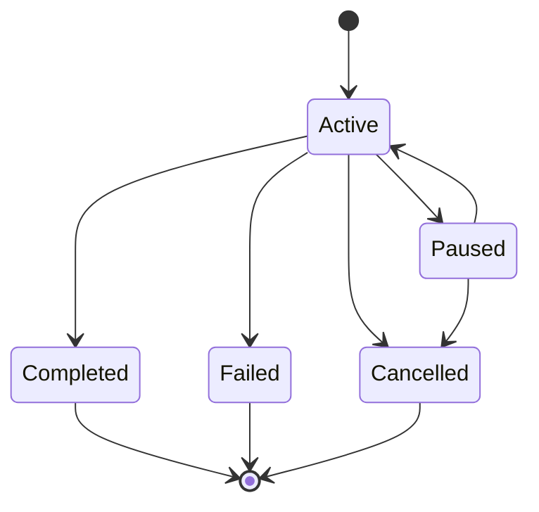
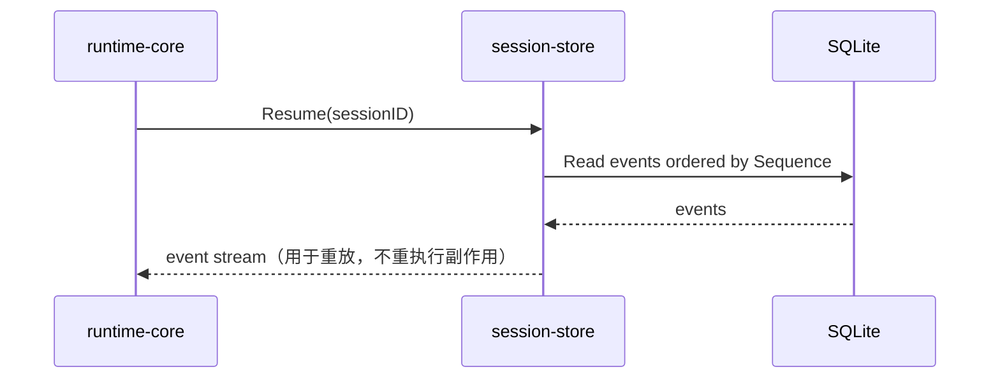

# session-store Spec

## 1. Module Info

| 字段 | 值 |
| --- | --- |
| Module ID | `session-store` |
| Module Name | Session Store |
| Status | Draft |
| Owner | 架构组（占位） |
| Dependencies | event-system |
| Dependents | runtime-core, context-manager, cli, evaluation, memory-system |
| Related Requirements | FR-SESSION-001..004, FR-SESSION-003 |
| Related ADRs | ADR-0002, ADR-0006 |
| MVP | Yes |

## 2. Purpose
session-store 拥有 Session 的持久化与恢复：Append-only Event Store、Session 元数据、Checkpoint。它是恢复能力（NFR-REL-001）的基础——事件是真相源，状态可由事件重建。

## 3. Scope
- SQLite Append-only Event Store，分配单 Session 内单调 Sequence，EventID 幂等去重。
- Session 元数据与 Session State 管理。
- Checkpoint 创建/读取。
- 从事件流重建状态（recovery 支撑，重放不触发外部副作用）。
- 事件增长控制（归档/截断，保留恢复所需子集）。
- Schema 版本与迁移（NFR-COMPAT-001）。

## 4. Non-goals
- 不定义事件格式（event-system）。
- 不重建 Agent 业务状态机本身（runtime-core 用本模块读出的事件重放）。
- 不拥有 Memory（memory-system，虽共用 SQLite）。
- 不实现压缩算法（context-manager；本模块仅存 Checkpoint）。

## 5. Responsibilities
- 拥有 Session、Event（存储）、Message、Checkpoint。
- 订阅 event-system 的 Durable 类事件并落盘，分配 Sequence。
- 提供按 Session 顺序读取事件流。
- 提供 Checkpoint 读写与 Session 列表/状态查询。
- 启用 WAL，串行化单 Session 写入（RISK-017）。

## 6. Public Interfaces

```go
type Store interface {
    CreateSession(ctx context.Context, meta SessionMeta) (*Session, error)
    GetSession(ctx context.Context, id string) (*Session, error)
    ListSessions(ctx context.Context, f SessionFilter) ([]Session, error)
    UpdateState(ctx context.Context, id string, s SessionState) error
}

type EventLog interface {
    Append(ctx context.Context, e eventsystem.Event) (seq int64, err error) // 分配 Sequence；EventID 去重
    Read(ctx context.Context, sessionID string, from int64) ([]eventsystem.Event, error)
}

type Checkpointer interface {
    Create(ctx context.Context, sessionID string, label string) (CheckpointID, error)
    Get(ctx context.Context, id CheckpointID) (*Checkpoint, error)
    List(ctx context.Context, sessionID string) ([]Checkpoint, error)
}
```

## 7. Domain Model
- `Session`（id、状态、元数据、时间、预算累计引用）。
- `Event`（存储行：Envelope + 分配的 Sequence）。
- `Message`（模型消息）。
- `Checkpoint`（指向某 Sequence 的快照点 + 必要状态摘要）。
- `SessionState` 枚举（见 GLOSSARY）。

## 8. State Machine



## 9. Core Flows
- **追加**：订阅 Durable 事件 → 事务内分配下一 Sequence → 去重检查 EventID → 写入。
- **读取/重放**：runtime-core Resume 时按 Session 读 from=0 或上次 Checkpoint Sequence。
- **Checkpoint**：在压缩前/高风险前创建，记录 Sequence 与状态摘要。
- **归档**：超阈值时归档冷事件，保留恢复所需子集（RISK-016）。
- **迁移**：启动时检查 Schema 版本，按需迁移。



## 10. Configuration

| Key | 默认值 | 作用域 | 敏感 | 说明 |
| --- | --- | --- | --- | --- |
| `store.db_path` | `~/.forgecode/forge.db` | 全局 | 否 | SQLite 路径 |
| `store.wal` | true | 全局 | 否 | 启用 WAL |
| `store.archive_threshold` | 50000 events/session | 全局 | 否 | 归档阈值 |
| `store.write_timeout` | 5s | 全局 | 否 | 写超时 |

## 11. Persistence
拥有并写入 Session/Event/Message/Checkpoint 表（SQLite）。Schema 带版本号，提供迁移脚本。memory-system 使用同一 DB 但独立表（拥有权分离）。

## 12. Concurrency
- 单写者模型 + WAL；单 Session 写串行化（事务内分配 Sequence 保证有序与幂等）。
- 多 Session 写经写串行化或分片（RISK-017）。
- 读可并发（WAL）。
- 取消经 context 传播。
- 幂等：EventID 重复 Append 被忽略。

## 13. Error Model
`PersistenceError`（写失败/锁；重试，持续失败暂停 Session 告警，不静默丢事件）、`RecoveryError`（重放读取失败）、`ConflictError`（Sequence/EventID 冲突）、`TimeoutError`（写超时）。

## 14. Security
- 审计事件 append-only + 序号单调 + EventID 去重 → 防审计篡改。
- DB 文件权限受限；Payload 中敏感数据由生产方在落库前脱敏（telemetry 协同）。
- 不在普通日志输出事件 Payload。

## 15. Observability
- 指标：事件写入速率、DB 大小、归档次数、写失败/重试数、恢复耗时。
- 事件：CheckpointCreated、CheckpointRestored。

## 16. Testing Strategy
- Unit：Append 去重、Sequence 单调、Checkpoint 读写。
- Integration：与 event-system 订阅落盘、与 runtime-core 恢复。
- Recovery：杀进程后读流重建（NFR-REL-001）。
- Race：并发写串行化 `go test -race`。
- Failure Injection：写失败/锁/迁移失败。
- Migration：旧 Schema 升级测试（NFR-COMPAT-001）。

## 17. Acceptance Criteria
- [ ] 单 Session 事件 Sequence 严格单调、连续。
- [ ] 重复 EventID 不产生重复行。
- [ ] 杀进程后可读出完整事件流供重放。
- [ ] Checkpoint 可创建并定位到 Sequence。
- [ ] 写失败重试，持续失败暂停 Session 而非丢事件。
- [ ] 旧 Schema 可被新版本读取/迁移。

## 18. Risks
RISK-016（无限增长）、RISK-017（SQLite 并发）、RISK-001。

## 19. Open Questions
- SQLite 驱动选型（OPEN_QUESTIONS Q2）。
- 归档存储形态（同库冷表 vs 外部文件，Q9）。
- Checkpoint 是否含完整状态快照还是仅 Sequence 指针 + 摘要。
