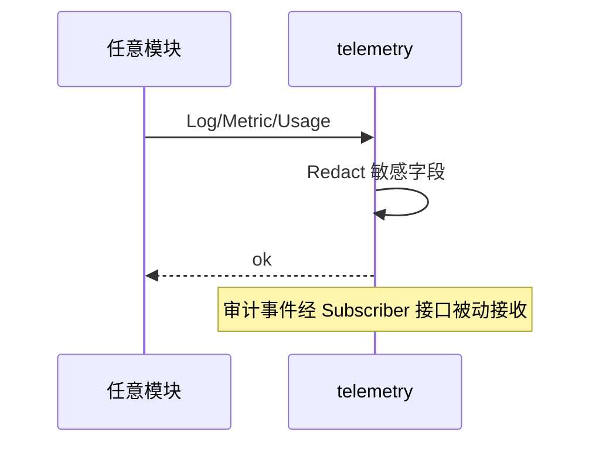

# telemetry Spec

## 1. Module Info

| 字段 | 值 |
| --- | --- |
| Module ID | `telemetry` |
| Module Name | Telemetry |
| Status | Draft |
| Owner | 架构组（占位） |
| Dependencies | （无业务依赖） |
| Dependents | 全体模块 |
| Related Requirements | FR-TELEMETRY-001..004 |
| Related ADRs | ADR-0002（审计） |
| MVP | Yes |

## 2. Purpose
telemetry 提供结构化日志、敏感数据脱敏、指标、可选 Trace、审计落地（AuditSink）与 Usage/Cost 记账。它是底层基础设施，被广泛依赖但不反向依赖业务模块，避免成为 utils 垃圾桶。

## 3. Scope
- 结构化日志与脱敏（密钥/Token/完整环境变量绝不入普通日志）。
- 指标采集（轮次/工具调用/Token/Cost/错误率）。
- 可选 Trace。
- AuditSink：以 Subscriber 身份消费 event-system 审计类事件并落地。
- UsageRecord：按 Session/Agent/Team 聚合 Token/Cost。

## 4. Non-goals
- 不定义事件格式（event-system）。
- 不做权限/审批决策（permission-engine）。
- 不拥有 Session/Event 存储（session-store；UsageRecord 由本模块拥有）。
- 不实现外部监控后端（仅导出接口）。

## 5. Responsibilities
- 拥有 UsageRecord 与日志/指标。
- 提供 Logger/Metrics/Tracer/AuditSink/UsageMeter 接口。
- 强制脱敏规则（NFR-SEC-002）。
- 通过实现 event-system 的 `Subscriber` 接口接收审计事件（依赖反转，telemetry 不 import event-system 的 Bus 实现）。

## 6. Public Interfaces

```go
type Logger interface {
    Info(msg string, kv ...Field)
    Error(msg string, err error, kv ...Field)
    With(kv ...Field) Logger
}

type Metrics interface {
    Counter(name string, tags ...Tag) Counter
    Histogram(name string, tags ...Tag) Histogram
}

type AuditSink interface {  // 实现 eventsystem.Subscriber
    OnEvent(ctx context.Context, e eventsystem.Event) error
}

type UsageMeter interface {
    Record(ctx context.Context, u UsageRecord) error
    Aggregate(ctx context.Context, scope UsageScope) (UsageSummary, error)
}

type Redactor interface {
    Redact(v any) any // 移除/掩码敏感字段
}
```

## 7. Domain Model
- `UsageRecord`（SessionID/AgentID/TeamID、模型、inputTokens、outputTokens、costUSD、时间）。
- `Field/Tag`、`UsageScope`、`UsageSummary`。
- `RedactionRule`（字段名/模式匹配）。
- 本模块拥有 UsageRecord、日志、指标。

## 8. State Machine
无生命周期实体。

## 9. Core Flows
- **日志**：调用方 Logger.Info/Error → Redactor 脱敏 → 结构化输出。
- **审计**：event-system 投递 Audit 类事件 → AuditSink.OnEvent → 脱敏 → 落审计存储（经 session-store 或独立审计表）。
- **Usage**：model-provider/runtime-core 调用 UsageMeter.Record → 聚合查询。
- **指标**：各模块上报 Counter/Histogram。



## 10. Configuration

| Key | 默认值 | 作用域 | 敏感 | 说明 |
| --- | --- | --- | --- | --- |
| `telemetry.log_level` | info | 全局 | 否 | 日志级别 |
| `telemetry.redact_keys` | `api_key,token,password,secret,authorization` | 全局 | 是 | 脱敏字段 |
| `telemetry.trace_enabled` | false | 全局 | 否 | 是否启用 Trace |
| `telemetry.metrics_export` | none | 全局 | 否 | 指标导出后端 |

## 11. Persistence
拥有 UsageRecord 表（SQLite，与 session-store 同库不同表）。日志/指标默认输出到文件/标准输出，可导出外部后端。

## 12. Concurrency
- Logger/Metrics 线程安全，高并发调用。
- AuditSink 单订阅者有序消费审计事件。
- UsageMeter.Record 并发安全（聚合时加锁或原子）。

## 13. Error Model
`PersistenceError`（UsageRecord 写失败）、`ValidationError`（指标名非法）。日志/指标失败不应阻断业务主流程（best-effort，错误内部记录）。

## 14. Security
- 强制脱敏：密钥/Token/完整环境变量绝不进普通日志（NFR-SEC-002）。
- 审计落地 append-only，配合 session-store 防篡改。
- Redactor 对结构化字段与自由文本均生效。

## 15. Observability
- 自监控：脱敏命中数、日志丢弃数、审计落地延迟、Usage 写失败数。

## 16. Testing Strategy
- Unit：Redactor 脱敏、Usage 聚合、指标记录。
- Security：构造含密钥的日志输入，验证不泄露（NFR-SEC-002）。
- Integration：AuditSink 消费 event-system 审计事件。
- Race：并发日志/指标 `go test -race`。

## 17. Acceptance Criteria
- [ ] 含密钥/Token 的输入经日志后不出现明文。
- [ ] 审计事件被 AuditSink 完整落地。
- [ ] UsageRecord 可按 Session/Agent/Team 聚合。
- [ ] telemetry 不 import 任何业务模块（依赖检查）。
- [ ] 日志/指标失败不阻断主流程。

## 18. Risks
审计篡改（由 append-only 缓解）、RISK-013（成本统计支撑预算）。

## 19. Open Questions
- 指标导出后端选型（Prometheus/OTel）。
- 审计存储是否独立于 session-store 事件表。
- 自由文本脱敏的误杀率与正则维护。
