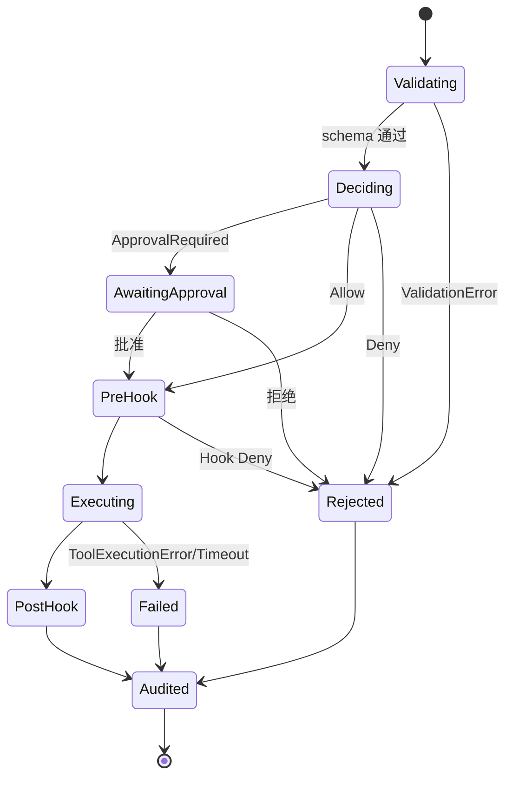

# tool-runtime Spec

## 1. Module Info

| 字段 | 值 |
| --- | --- |
| Module ID | `tool-runtime` |
| Module Name | Tool Runtime |
| Status | Draft |
| Owner | 架构组（占位） |
| Dependencies | permission-engine, event-system, telemetry |
| Dependents | runtime-core, builtin-tools, mcp-client, extension-system |
| Related Requirements | FR-TOOL-001..004 |
| Related ADRs | ADR-0004, ADR-0005 |
| MVP | Yes |

## 2. Purpose
tool-runtime 拥有统一的 `Tool` 抽象、`ToolDescriptor`、Tool Registry 和 **统一调用管线**。它是所有工具（内置、MCP、Skill 触发）进入运行时的单一通道，确保每次调用都经过校验、权限、Hook、执行与审计，消除"绕过权限"的反模式。

## 3. Scope
- 定义 `Tool` 接口与 `ToolDescriptor`（名称、JSON Schema、风险标注、权限要求、来源/Namespace）。
- Tool Registry：注册、发现、命名冲突处理。
- Invoker：统一管线 Validation→Permission→PreHook→Execute→PostHook→Audit。
- 输出截断挂钩、超时控制、错误分类、调用审计编排。
- ToolCall/ToolResult 契约定义。

## 4. Non-goals
- 不实现具体工具（builtin-tools）。
- 不做权限决策（permission-engine，仅调用）。
- 不实现 Hook 逻辑（extension-system，仅在管线点位触发事件/分发）。
- 不直接连接 MCP（mcp-client 注册 MCP 工具到 Registry）。
- 不拥有 ToolResult 存储（落库经 session-store）。

## 5. Responsibilities
- 拥有 ToolCall/ToolResult 契约结构。
- 在唯一管线中编排各阶段，保证顺序不可跳过。
- 将工具来源（builtin/mcp/namespace）标注到 Descriptor。
- 在 PreToolUse/PostToolUse/ToolFailure 点位产生事件。
- 调用 permission-engine 决策；ApprovalRequired 时上抛给 runtime-core。
- 截断超大输出（与 context-manager 协同上限）、超时终止。

## 6. Public Interfaces

```go
type ToolDescriptor struct {
    Name        string          // 含 namespace，如 "mcp:github/create_issue"
    Source      ToolSource      // Builtin | MCP | Skill
    InputSchema json.RawMessage // JSON Schema
    Risk        RiskLevel       // 默认风险标注
    Permission  PermissionHint  // 需求的权限提示
}

type Tool interface {
    Descriptor() ToolDescriptor
    Execute(ctx context.Context, input json.RawMessage) (ToolResult, error)
}

type Registry interface {
    Register(t Tool) error          // 命名冲突报 ConflictError
    Get(name string) (Tool, bool)
    List() []ToolDescriptor
}

type Invoker interface {
    Invoke(ctx context.Context, call ToolCall) (ToolResult, error)
}

type ToolCall struct {
    ID    string
    Name  string
    Input json.RawMessage
    Ctx   InvocationContext // SessionID, AgentID, 来源
}

type ToolResult struct {
    CallID    string
    Output    string
    Truncated bool
    IsError   bool
    Category  ErrorCategory // 见 GLOSSARY
}
```

## 7. Domain Model
- `ToolDescriptor`、`Tool`、`Registry`、`Invoker`、`ToolCall`、`ToolResult`、`InvocationContext`、`ToolSource` 枚举（Builtin/MCP/Skill）。
- 本模块拥有 ToolCall/ToolResult **契约**；ToolResult 存储归 session-store。

## 8. State Machine
单次调用的管线阶段（非持久生命周期）：



## 9. Core Flows
- **正常**：Invoke → 校验 input 对 schema → permission-engine.Decide → PreToolUse 事件/Hook → Execute（带超时） → 截断输出 → PostToolUse 事件/Hook → 审计 → 返回 ToolResult。
- **审批**：Decide 返回 ApprovalRequired → 返回特殊结果让 runtime-core 进入 AwaitingApproval；批准后重新进入管线 Execute 段。
- **失败**：Execute 错误归类为 ToolExecutionError/TimeoutError → ToolFailure 事件 → 仍走审计 → 返回 IsError 结果（不抛给模型为致命）。
- **MCP**：mcp-client 注册的 Tool 走同一管线，附加来源与输出大小限制。

## 10. Configuration

| Key | 默认值 | 作用域 | 敏感 | 说明 |
| --- | --- | --- | --- | --- |
| `tool.default_timeout` | 60s | 全局/可按工具覆盖 | 否 | 工具执行超时 |
| `tool.max_output_bytes` | 100KB | 全局 | 否 | 输出截断上限 |
| `tool.audit_input` | true | 全局 | 否 | 是否审计原始输入（脱敏后） |

## 11. Persistence
本模块不持久化；ToolResult 与审计经事件交 session-store / telemetry。

## 12. Concurrency
- Registry 读多写少，注册期加锁，运行期只读快照。
- 单次 Invoke 无共享可变状态；并发调用安全。
- 超时与取消经 context 传播到 Tool.Execute。
- 管线阶段顺序保证：不可跳过 Permission/Audit。

## 13. Error Model
`ValidationError`（schema 不符）、`PermissionDenied`（Deny）、`ApprovalRequired`（转审批）、`ToolExecutionError`、`TimeoutError`、`CancelledError`、`ConflictError`（注册命名冲突）。

## 14. Security
- 单点强制权限：任何 Invoke 必经 permission-engine（NFR-SEC-001）。消除"MCP 工具绕过权限"。
- 工具输出视为不可信，截断且标注来源，交 context-manager 处理注入风险。
- 审计记录原始输入（脱敏）、决策、结果、来源。
- Namespace 防止 MCP 工具冒充内置工具（ADR-0004）。

## 15. Observability
- 事件：PreToolUse、PostToolUse、ToolFailure、AuditRecorded。
- 指标：每工具调用次数、耗时、失败率、截断率。
- 审计事件交 telemetry AuditSink。

## 16. Testing Strategy
- Unit：校验、截断、超时、命名冲突。
- Integration：与 permission-engine + builtin-tools 跑通管线。
- Contract：内置与 MCP 工具共用同套管线行为测试。
- Failure Injection：工具 panic/超时/取消。
- Security：构造绕过尝试，验证无旁路。

## 17. Acceptance Criteria
- [ ] 任何 Invoke 都经过 Validation→Permission→Hook→Execute→Audit，缺一即测试失败。
- [ ] 命名冲突注册返回 ConflictError。
- [ ] 超大输出被截断且标注 Truncated。
- [ ] 超时/取消正确终止并归类。
- [ ] MCP 工具与内置工具行为通过同套 Contract Test。

## 18. Risks
RISK-005（Schema 不一致）、RISK-020（接口漂移）。

## 19. Open Questions
- 输出截断与 context-manager 的职责切分：tool-runtime 做硬上限，context-manager 做语义压缩，边界需 M3 校准。
- 审批结果回填管线的实现方式（重入 vs 续传），待 runtime-core 集成确定。
