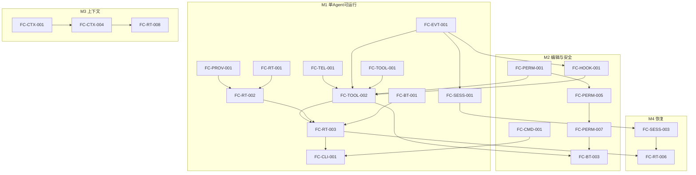

# MASTER_TASKS

汇总全部模块任务，按 Milestone 分组，标注关键路径、可并行性、阻塞与 Task DAG。模块内任务详情见 `docs/tasks/<module-id>/TASKS.md`。状态：Backlog/Ready/In Progress/Blocked/Done。

## 任务总览（按模块前缀）

| 前缀 | 模块 | 任务范围 |
| --- | --- | --- |
| FC-RT | runtime-core | 000–009 |
| FC-PROV | model-provider | 001–009 |
| FC-TOOL | tool-runtime | 001–007 |
| FC-BT | builtin-tools | 001–007 |
| FC-PERM | permission-engine | 001–008 |
| FC-EVT | event-system | 001–005 |
| FC-SESS | session-store | 000–007 |
| FC-CTX | context-manager | 001–007 |
| FC-TEL | telemetry | 001–005 |
| FC-CLI | cli | 001–007 |
| FC-CMD/HOOK/SKILL/EXT | extension-system | 命令/Hook/Skill 系列 |
| FC-MCP | mcp-client | 001–006 |
| FC-MEM | memory-system | 001–006 |
| FC-SBX | sandbox | 001–005 |
| FC-SUB/TEAM/ORCH | agent-orchestration | SubAgent/Team 系列 |
| FC-WT | git-worktree | 000–005 |
| FC-EVAL | evaluation | 001–006 |

## 架构基石任务（必须先完成，最高优先）

这些任务定义被广泛依赖的接口/契约，应优先且由单一负责人完成以防接口漂移（RISK-020）：

- **FC-EVT-001**（Event Envelope）— 几乎所有模块依赖。
- **FC-SESS-000**（SQLite Spike）+ **FC-SESS-001**（Event Store）。
- **FC-PROV-001**（Provider 接口）。
- **FC-TOOL-001**（Tool 接口/Registry）→ **FC-TOOL-002**（统一管线）。
- **FC-PERM-001**（Decider 接口）。
- **FC-RT-001**（状态机）→ **FC-RT-002**（Coordinator）。
- **FC-TEL-001**（Logger/脱敏）。

## MVP 关键路径（M1–M5）

```text
FC-RT-000(Go Spike) ─┐
FC-EVT-001 ──────────┼─→ FC-SESS-001 ─→ FC-SESS-003(恢复)
FC-TEL-001 ──────────┘                         │
FC-PROV-001 ─→ FC-PROV-002(Mock) ─→ FC-PROV-003/004/005 ─→ FC-PROV-006(OpenAI)
FC-TOOL-001 ─→ FC-TOOL-002(管线) ─→ FC-TOOL-003/005
FC-PERM-001 ─→ FC-PERM-002/003/004/005 ─→ FC-PERM-007(审批)
FC-RT-001 ─→ FC-RT-002 ─→ FC-RT-003(Loop) ─→ FC-RT-004/005
FC-BT-001 ─→ FC-BT-002(Read)/FC-BT-004(Bash)/FC-BT-005(Glob/Grep)
FC-CLI-001 ─→ FC-CLI-002/004
[M2] FC-BT-003(Write/Edit) + FC-PERM-007 + FC-TOOL-004 + FC-CMD-001 + FC-HOOK-001..003
[M3] FC-CTX-001 ─→ FC-CTX-002/003 ─→ FC-CTX-004/005 ─→ FC-RT-008
[M4] FC-RT-006(恢复) + FC-SESS-003 + FC-CLI-005/006
```

关键路径核心链：**FC-EVT-001 → FC-SESS-001 → FC-TOOL-001 → FC-TOOL-002 → FC-RT-002 → FC-RT-003 → FC-CLI-001**（单 Agent 只读闭环），随后 **FC-PERM-001 → FC-PERM-005 → FC-PERM-007 → FC-BT-003**（编辑与审批闭环）。

## Task DAG（里程碑级，Mermaid）



## 后续里程碑任务（V0.2+）

| Milestone | 主要任务 | 依赖 |
| --- | --- | --- |
| M6 扩展系统 | FC-CMD-002, FC-SKILL-001/002/003, FC-CMD-100 | M2（命令/Hook） |
| M7 MCP | FC-MCP-001..006, FC-TOOL-006 | M2（统一管线） |
| M8 记忆 | FC-MEM-001..006, FC-SESS-004 | M1（session-store） |
| M9 沙箱+评测 | FC-SBX-001..005, FC-EVAL-001..003 | M2（L4 挂钩）、M4（Replay 依赖恢复） |
| M10 SubAgent | FC-SUB-001..004, FC-SKILL-004, FC-EVAL-004 | M1–M3（Runtime） |
| M11 Worktree | FC-WT-000..005 | M2（工具/事件） |
| M12 Team | FC-TEAM-001..003, FC-ORCH-900 | M10+M11 |
| M13 展示 | FC-EVAL-005, 文档/Demo | 全部 |

## 可并行任务（不同 Agent，不同文件）

- **M1 并行组**：`model-provider`（FC-PROV-*）、`telemetry`（FC-TEL-*）、`event-system`（FC-EVT-*）、`builtin-tools 只读`（FC-BT-002/005）可与状态机/Coordinator 并行开发，仅在 FC-TOOL-002 管线集成处汇合。
- **M2 并行组**：`permission-engine`（FC-PERM-*）与 `extension-system Hook`（FC-HOOK-*）、`builtin-tools 写`（FC-BT-003）可并行，汇合于 FC-TOOL-002/004。
- **V0.2 并行**：`mcp-client`、`memory-system`、`extension-system Skill`、`sandbox` 模块边界清晰，可分配不同 Agent，仅共享 tool-runtime/permission-engine 接口（已冻结，避免改动）。
- **V0.3 并行**：`agent-orchestration SubAgent`（FC-SUB-*）与 `git-worktree`（FC-WT-*）不同文件，可并行。

## 共享文件冲突风险

- **接口契约文件**（Event Envelope、Tool/Descriptor、Provider、Decider）：由单一负责人维护，冻结后并行开发引用，禁止并行修改（RISK-020）。
- **tool-runtime 管线**（FC-TOOL-002）：builtin-tools、mcp-client、extension-system 均依赖，应先稳定再并行接入。
- **GLOSSARY/EVENT_MODEL/DATA_OWNERSHIP**：任何并行 Agent 不得擅自改动；需变更走评审同步全文档（见 AGENTS.md）。

## 阻塞关系要点

- 所有工具相关任务阻塞于 FC-TOOL-002（管线）。
- 所有恢复相关任务阻塞于 FC-SESS-001/003。
- 所有 Hook/命令阻塞于 FC-EVT-001/002。
- Team（M12）阻塞于 SubAgent（M10）与 Worktree（M11）。
- evaluation Replay（FC-EVAL-001）阻塞于 session-store 恢复（FC-SESS-003）。
